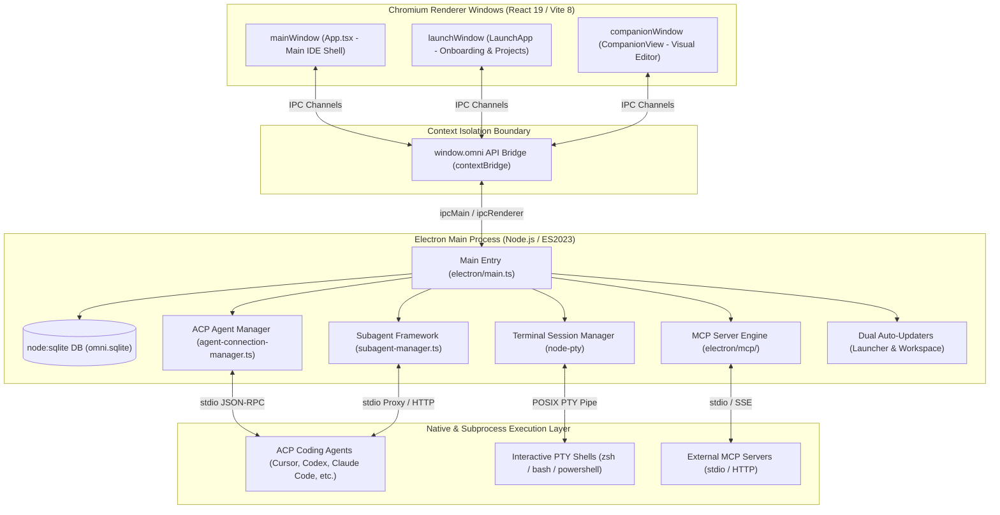
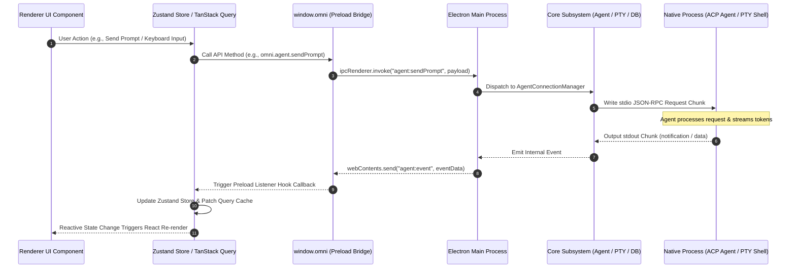
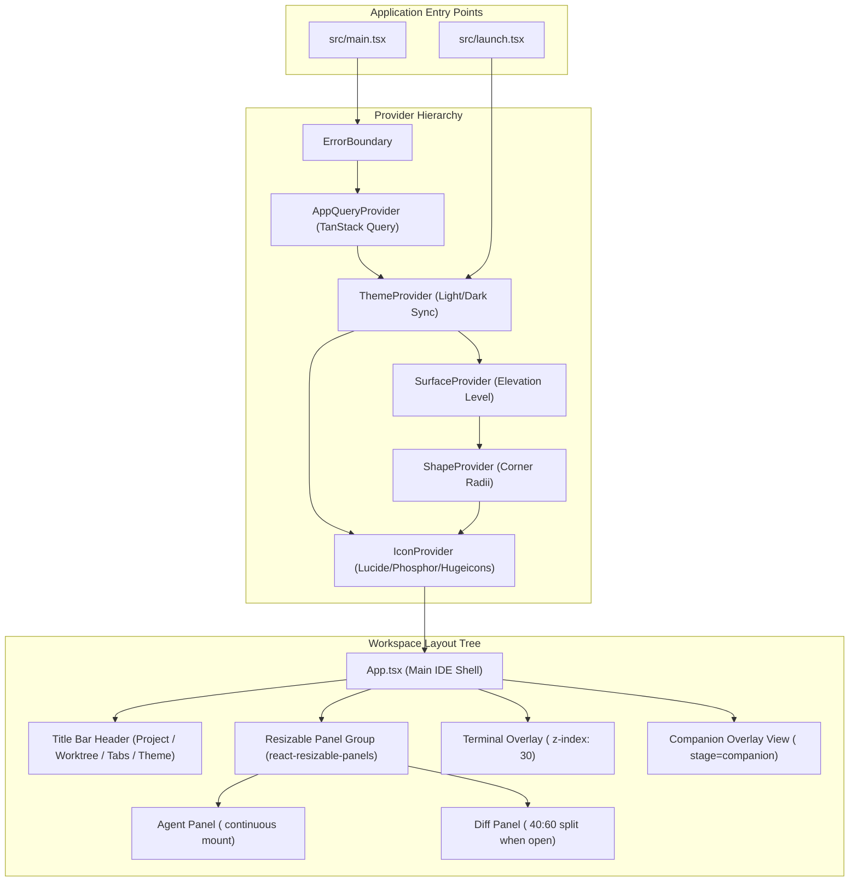
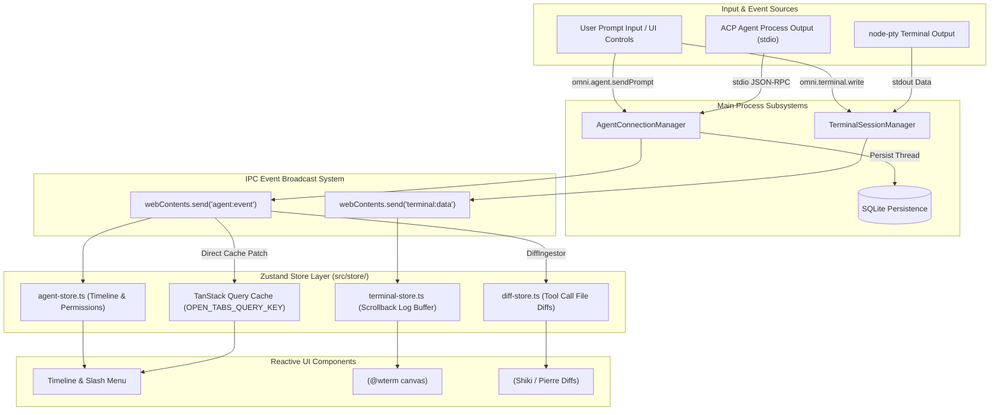

# Omni (Pipper Code) — Complete System Architecture Map

**App Identity:** `pipper-code-alpha` (Version `0.0.22`)  
**Target Path:** `/Users/harshithpasupuleti/code/omni/ARCHITECTURE_MAP.md`  
**Generated Date:** July 21, 2026

---

## 1. Executive Overview & Tech Stack

`omni` (published under the package identity `pipper-code-alpha`, version `0.0.22`) is an enterprise-grade desktop AI-powered code editor and multi-agent development environment built on top of **Electron 42**. It merges real-time interactive LLM agent interaction, native PTY terminal emulation, visual element editing, git worktree isolation, and extensible Model Context Protocol (MCP) tool integration into a unified desktop application shell.

### Tech Stack Matrix

| Layer / Subsystem            | Technology                            | Version / Specification                         | Purpose & Key Details                                                                    |
| ---------------------------- | ------------------------------------- | ----------------------------------------------- | ---------------------------------------------------------------------------------------- |
| **Runtime Environment**      | **Electron**                          | `v42.3.3`                                       | Cross-platform desktop app framework supporting Chromium + Node.js integration.          |
| **Package & Script Runtime** | **Bun** & **Node.js**                 | ES2023 ESM (`"type": "module"`)                 | Fast JavaScript runtime, package manager, and dependency engine.                         |
| **UI Framework**             | **React**                             | `v19.2.6` (with React Compiler)                 | Component UI tree with compiler optimization via Babel/Rolldown.                         |
| **Build & Bundler Tooling**  | **Vite** & **electron-vite**          | Vite `v8.0.12`, `electron-vite` `v5.0.0`        | Multi-target HMR & production bundler (`main`, `preload`, `renderer`).                   |
| **CSS & Styling System**     | **Tailwind CSS**                      | `v4.3.0` (`@tailwindcss/vite`)                  | Semantic theme tokenization, dark/light surface elevation systems.                       |
| **Database & Persistence**   | **Node Native SQLite**                | `node:sqlite` (`DatabaseSync`)                  | Synchronous, embedded relational database for projects, threads, users, MCP.             |
| **Agent Protocol**           | **ACP (Agent Client Protocol)**       | `@agentclientprotocol/sdk`                      | Stdio JSON-RPC protocol bridging Electron main process to LLM agent processes.           |
| **Terminal Integration**     | **node-pty** & **@wterm**             | `node-pty` native C++ binding                   | Pseudoterminal execution engine connected to `@wterm/react` & xterm canvas renderer.     |
| **State Management**         | **Zustand** & **TanStack Query**      | Zustand `v5.0.14`, `@tanstack/react-query`      | 13 specialized client stores combined with reactive query caching and IPC patching.      |
| **UI Primitive Suite**       | **Base UI**, **Radix UI**, **Lucide** | `@base-ui/react`, `@radix-ui/*`, `lucide-react` | Accessible headless primitives, icon sets (`lucide`, `phosphor`, `hugeicons`, `tabler`). |
| **Packaging & Distribution** | **electron-builder**                  | `v26.15.2`                                      | ASAR packaging with native module unpacking for macOS DMG (`arm64`) & Windows NSIS.      |

---

## 2. Process Architecture & Security Model

`omni` enforces a multi-process architecture consisting of an **Electron Main Process**, a **Preload Script context isolation boundary**, and three distinct **Chromium Renderer Windows**.

```
                           +-----------------------------------------+
                           |           ELECTRON MAIN PROCESS          |
                           |   (Node.js Runtime / node:sqlite / PTY)  |
                           +--------------------+--------------------+
                                                |
                         +----------------------+----------------------+
                         |                      |                      |
            +------------v-----------+ +--------v---------------+ +----v--------------------+
            |      mainWindow        | |      launchWindow      | |     companionWindow     |
            |  (Main IDE Workspace)  | | (Onboarding & Projects)| |  (Visual Canvas Editor) |
            +------------+-----------+ +--------+---------------+ +----+--------------------+
                         |                      |                      |
                         +----------------------+----------------------+
                                                |
                                                v
                               +---------------------------------+
                               |  window.omni Preload API Bridge |
                               |    (contextIsolation: true)     |
                               +---------------------------------+
```

### 2.1 Multi-Window Architecture

1. **Main Application Window (`mainWindow`)**:
   - **Role**: Primary IDE workspace shell providing agent panels, split diff viewer, and terminal overlay.
   - **Dimensions**: Default 1280x800, minimum 720x480.
   - **Title & Identity**: Uses a dynamic window title ID (e.g. `generateRandomId()`).
   - **WebPreferences**: `preload: out/preload/index.js`, `contextIsolation: true`, `nodeIntegration: false`, `sandbox: false`.
   - **Dev Server**: Spawns local Vite dev server on an available port (`bun run vite --host 127.0.0.1`) during development.

2. **Launcher / Onboarding Window (`launchWindow`)**:
   - **Role**: Initial window opened on first boot or workspace setup. Manages project creation, user authentication via Clerk, and system dependency verification.
   - **Dimensions**: Default 960x720, minimum 640x560. Title: `"Welcome to Pipper Code (Alpha)"`.
   - **WebPreferences**: `preload: out/preload/index.js`, `contextIsolation: true`, `nodeIntegration: false`, `sandbox: false`. Loads `launch.html`.

3. **Companion Overlay Window (`companionWindow`)**:
   - **Role**: Floating auxiliary window attached to `mainWindow` for component visual editing and prompt-to-UI mutations.
   - **Dimensions**: Restored from `companion-state.json` (default 400x640, min 320x480). Title: `"Companion"`, `titleBarStyle: "hidden"`. Parent set to `mainWindow`.
   - **Unaccepted Edit Protection**: Intercepts `close` events. If dirty visual edits exist, prompts the user via a native modal dialog (`"Keep Editing"`, `"Reject Changes"`, `"Close Without Reverting"`).

### 2.2 Security & Navigation Model

- **Context Isolation (`contextIsolation: true`)**: Renderer code cannot access Node.js globals (`require`, `process`, `fs`). All communication must cross the `window.omni` contextBridge API.
- **Node Integration Disabled (`nodeIntegration: false`)**: Prevents XSS vulnerabilities from executing arbitrary Node commands in renderer web contexts.
- **Navigation URL Origin Checks**: The main process registers a `setWindowOpenHandler` on all web contents. Any navigation request to external URLs is intercepted. Only explicit whitelisted domains (e.g., Clerk OAuth login endpoints) are passed to `shell.openExternal()`; all other unapproved popups and navigations are hard-blocked.

---

## 3. Main Process Core Subsystems

The Main process acts as the core engine powering persistence, LLM agent processes, PTY shells, workspace updates, and subagent orchestration.

```
┌──────────────────────────────────────────────────────────────────────────────────────────────────┐
│                                    MAIN PROCESS CORE SUBSYSTEMS                                   │
├─────────────────┬───────────────────┬───────────────────┬──────────────────┬─────────────────────┤
│ SQLite Storage  │  ACP Agent Mgmt   │ Subagent Engine   │ MCP Subsystem    │ Terminal Manager    │
│ (electron/db.ts)│ (agent-connection)│ (subagent-manager)│ (electron/mcp/)  │ (node-pty wrapper)  │
├─────────────────┼───────────────────┼───────────────────┼──────────────────┼─────────────────────┤
│ • projects      │ • Cursor ACP      │ • Max depth limit │ • McpHttpServer  │ • zsh/bash/PowerShell│
│ • threads       │ • OpenAI Codex    │ • stdio proxy     │ • Stdio client   │ • Interactive PTY   │
│ • mcp_servers   │ • Claude Code     │ • Concurrency     │ • Server registry│ • PATH resolution   │
│ • auth_users    │ • Opencode / Grok │   control         │ • Tool proxying  │ • Output buffering  │
│ • agent_select  │ • Gemini/Copilot  │                   │                  │                     │
└─────────────────┴───────────────────┴───────────────────┴──────────────────┴─────────────────────┘
```

### 3.1 SQLite Data Persistence (`electron/db.ts`)

- **Database Engine**: Uses Node.js native `DatabaseSync` from `node:sqlite`. Located at `app.getPath("userData")/omni.sqlite`.
- **Database Schema**:
  - `projects`: Stores workspace metadata (`id`, `path` UNIQUE, `name`, `icon`).
  - `threads`: Stores agent thread sessions (`id`, `project_id` FK, `agent_id`, `agent_session_id`, `title`, `worktree_path`, `sort_order`, `created_at`, `last_used_at`).
  - `user_agent_selections`: Tracks selected agent engines per user/session (`agent_id`, `selected_at`).
  - `mcp_servers`: Configured Model Context Protocol servers (`id`, `name`, `transport_type`, `url`, `command`, `args`, `env`, `created_at`, `updated_at`).
  - `auth_users`: Clerk/OAuth user profile cache (`provider`, `provider_user_id` PK, `email`, `name`, `avatar_url`, `created_at`, `updated_at`, `last_seen_at`).
- **JSON Configuration Files**:
  - `companion-state.json`: Window bounds and positioning for Companion window.
  - `launch-state.json`: Last selected project ID and setup completion flags.
  - `subagents.json`: Configured subagent execution constraints (max depth, timeout, concurrency).

### 3.2 ACP Agent Connection Manager & Agent Registry

- **Protocol Architecture**: Implements the Agent Client Protocol (ACP) over stdio JSON-RPC using `@agentclientprotocol/sdk`.
- **Supported ACP Agent Engines**:
  1. `cursor-acp`: Cursor CLI agent stdio adapter.
  2. `codex-acp`: Bundled OpenAI Codex agent (`@agentclientprotocol/codex-acp`).
  3. `claude-agent-acp`: Anthropic Claude Code agent executable.
  4. `opencode-acp`: Opencode CLI agent.
  5. `grok-acp`: xAI Grok Build CLI agent.
  6. `gemini-acp`: Google Gemini CLI agent.
  7. `copilot-acp`: GitHub Copilot CLI agent.
  8. `pipper-mock`: Built-in Node.js mock agent for offline testing and verification.
- **Session Lifecycle & Reducer**: Manages `ThreadSessionRuntime` handles. Reducer `acp-session-reducer.ts` parses incoming ACP notification chunks (`text`, `tool_call`, `permission_request`, `turn_stop`) and maintains token context and cost statistics.

### 3.3 Subagent Framework (`electron/subagents/subagent-manager.ts`)

- Enables primary orchestrator agents to invoke subordinate child agents via `/subagent` slash commands.
- Enforces depth limits (`maxDepth`, default 3) to prevent infinite recursive subagent spawning.
- Wraps child processes with `McpHttpServer` and `stdio-proxy.ts` so subagents inherit parent MCP tools and environment configurations.

### 3.4 Model Context Protocol (`electron/mcp/`)

- Provides dynamic registration and execution of MCP tool servers over standard I/O or HTTP/SSE transports.
- Exposes tools directly to active ACP sessions, allowing agents to invoke custom user-defined tool plugins.

### 3.5 Native Terminal Session Manager (`node-pty`)

- Spawns interactive pseudoterminals using native C++ module `node-pty`.
- Resolves system user shell (macOS: `zsh` or `bash` with `-l` login flag; Windows: `powershell.exe`).
- Invokes `prependStandardPaths()` to ensure binary paths (`~/.local/bin`, `/opt/homebrew/bin`, `/usr/local/bin`) are included.
- Maps PTY instances by `sessionId` and streams stdout/stderr chunks directly to the renderer's `@wterm/react` grid components via `terminal:data` IPC push events.

### 3.6 Dual Auto-Updater System

1. **Launcher Update Manager (`LauncherUpdateManager`)**:
   - Manages Electron binary app updates released on GitHub Releases.
   - Downloads binary installers, verifies checksums, exposes diagnostic logs, and launches installer processes (`installAndQuit`).
2. **Workspace Code Update Manager (`UpdateManager`)**:
   - Manages live workspace code updates over Git fetch and promotion.
   - Executes pre-update health checks, maintains automated backups of active workspace code, and automatically triggers rollback if an update run fails health validation.

### 3.7 Automated Dependency Installer (`electron/dependency-installer.ts`)

- First-run verification tool that inspects host environment for Git, Mise version manager, Node.js, and Bun.
- Automatically installs missing tools inside `~/.pipper/library` without polluting global system paths.

---

## 4. Preload & IPC Contract Catalog

The preload script (`electron/preload.ts`) bridges Main and Renderer processes by exposing `window.omni`.

### 4.1 Request-Response & One-Way IPC Channels (111 Total)

#### 1. Launcher Update Subsystem (`launcher-update:*` — 13 channels)

| Channel                                 | Preload API Method                            | Arguments | Return Type                                     | Description                                                      |
| --------------------------------------- | --------------------------------------------- | --------- | ----------------------------------------------- | ---------------------------------------------------------------- |
| `launcher-update:check`                 | `omni.launcherUpdate.check()`                 | None      | `Promise<LauncherUpdateState>`                  | Checks remote repository for new launcher app binary release.    |
| `launcher-update:getState`              | `omni.launcherUpdate.getState()`              | None      | `Promise<LauncherUpdateState>`                  | Gets current launcher auto-updater state.                        |
| `launcher-update:isDismissedForSession` | `omni.launcherUpdate.isDismissedForSession()` | None      | `Promise<boolean>`                              | Returns whether user dismissed update prompt for active session. |
| `launcher-update:download`              | `omni.launcherUpdate.download()`              | None      | `Promise<LauncherUpdateState>`                  | Begins background download of binary installer package.          |
| `launcher-update:cancelDownload`        | `omni.launcherUpdate.cancelDownload()`        | None      | `Promise<LauncherUpdateState>`                  | Aborts active binary installer download.                         |
| `launcher-update:dismissForSession`     | `omni.launcherUpdate.dismissForSession()`     | None      | `Promise<LauncherUpdateState>`                  | Dismisses launcher update notification for current app session.  |
| `launcher-update:retryDownload`         | `omni.launcherUpdate.retryDownload()`         | None      | `Promise<LauncherUpdateState>`                  | Retries downloading installer after previous failure.            |
| `launcher-update:openDownloadFolder`    | `omni.launcherUpdate.openDownloadFolder()`    | None      | `Promise<void>`                                 | Opens OS file explorer at installer download directory.          |
| `launcher-update:downloadInBrowser`     | `omni.launcherUpdate.downloadInBrowser()`     | None      | `Promise<void>`                                 | Opens default web browser to direct download link.               |
| `launcher-update:clearDownloadedUpdate` | `omni.launcherUpdate.clearDownloadedUpdate()` | None      | `Promise<LauncherUpdateState>`                  | Removes cached binary installer file from local storage.         |
| `launcher-update:getDiagnostics`        | `omni.launcherUpdate.getDiagnostics()`        | None      | `Promise<LauncherUpdateDiagnostics>`            | Retrieves internal diagnostic logs for updater troubleshooting.  |
| `launcher-update:copyDiagnostics`       | `omni.launcherUpdate.copyDiagnostics()`       | None      | `Promise<void>`                                 | Copies updater diagnostic details to system clipboard.           |
| `launcher-update:installAndQuit`        | `omni.launcherUpdate.installAndQuit()`        | None      | `Promise<{ success: boolean; error?: string }>` | Triggers installer execution and quits current app process.      |

#### 2. Workspace Code Update Subsystem (`update:*` — 13 channels)

| Channel                      | Preload API Method                       | Arguments         | Return Type                        | Description                                                        |
| ---------------------------- | ---------------------------------------- | ----------------- | ---------------------------------- | ------------------------------------------------------------------ |
| `update:check`               | `omni.update.check()`                    | None              | `Promise<UpdateState>`             | Checks remote Git repository for available workspace code updates. |
| `update:getState`            | `omni.update.getState()`                 | None              | `Promise<UpdateState>`             | Returns current workspace updater state.                           |
| `update:getManifest`         | `omni.update.getManifest()`              | None              | `Promise<UpdateManifest \| null>`  | Retrieves remote workspace update manifest metadata.               |
| `update:getInstallation`     | `omni.update.getInstallation()`          | None              | `Promise<InstallationMetadata>`    | Fetches local workspace installation metadata and Git commit hash. |
| `update:getRun`              | `omni.update.getRun(runId)`              | `runId: string`   | `Promise<UpdateRunRecord \| null>` | Gets transcript log and status of specific update run ID.          |
| `update:getUpdaterSnapshot`  | `omni.update.getUpdaterSnapshot()`       | None              | `Promise<AcpSessionState>`         | Gets state snapshot of background update agent session.            |
| `update:scheduleForQuit`     | `omni.update.scheduleForQuit()`          | None              | `Promise<UpdateState>`             | Schedules code update promotion when application closes.           |
| `update:startNow`            | `omni.update.startNow()`                 | None              | `Promise<UpdateRunResult>`         | Executes workspace code update process immediately.                |
| `update:retryFailedUpdate`   | `omni.update.retryFailedUpdate()`        | None              | `Promise<UpdateState>`             | Retries workspace update after previous failure.                   |
| `update:dismiss`             | `omni.update.dismiss()`                  | None              | `Promise<UpdateState>`             | Dismisses workspace update notification toast/banner.              |
| `update:cancel`              | `omni.update.cancel()`                   | None              | `Promise<UpdateRunResult>`         | Cancels running workspace update operation.                        |
| `update:markActiveHealthy`   | `omni.update.markActiveHealthy(version)` | `version: string` | `Promise<boolean>`                 | Marks specified version as verified healthy after boot test.       |
| `update:quitWithoutUpdating` | `omni.update.quitWithoutUpdating()`      | None              | `Promise<void>`                    | Cancels any scheduled updates and immediately terminates app.      |

#### 3. Projects Subsystem (`projects:*` & `dialog:*` — 6 channels)

| Channel                | Preload API Method            | Arguments                   | Return Type                | Description                                                   |
| ---------------------- | ----------------------------- | --------------------------- | -------------------------- | ------------------------------------------------------------- |
| `projects:list`        | `omni.projects.list()`        | None                        | `Promise<Project[]>`       | Lists all registered workspace projects from SQLite database. |
| `projects:getActive`   | `omni.projects.getActive()`   | None                        | `Promise<Project \| null>` | Gets currently active workspace project record.               |
| `projects:listFiles`   | `omni.projects.listFiles()`   | None                        | `Promise<string[]>`        | Lists all git-tracked files in active project workspace.      |
| `projects:create`      | `omni.projects.create(input)` | `input: CreateProjectInput` | `Promise<Project>`         | Registers new project path in SQLite DB.                      |
| `projects:setActive`   | `omni.projects.setActive(id)` | `projectId: string`         | `Promise<void>`            | Switches active workspace project ID.                         |
| `dialog:pickDirectory` | `omni.dialog.pickDirectory()` | None                        | `Promise<string \| null>`  | Opens OS native folder picker dialog.                         |

#### 4. Git Worktrees & Branching (`worktrees:*` — 6 channels)

| Channel                   | Preload API Method                   | Arguments                                                    | Return Type                                       | Description                                          |
| ------------------------- | ------------------------------------ | ------------------------------------------------------------ | ------------------------------------------------- | ---------------------------------------------------- |
| `worktrees:list`          | `omni.worktrees.list(id)`            | `projectId: string`                                          | `Promise<Worktree[]>`                             | Lists all git worktrees associated with project.     |
| `worktrees:switch`        | `omni.worktrees.switch(input)`       | `input: { projectId: string; path: string }`                 | `Promise<Thread>`                                 | Switches active worktree context path.               |
| `worktrees:getSelections` | `omni.worktrees.getSelections()`     | None                                                         | `Promise<Record<string, string>>`                 | Gets map of selected worktrees per project ID.       |
| `worktrees:listBranches`  | `omni.worktrees.listBranches(input)` | `input: { projectId: string }`                               | `Promise<GitBranch[]>`                            | Lists local and remote git branches.                 |
| `worktrees:switchBranch`  | `omni.worktrees.switchBranch(input)` | `input: { projectId: string; path: string; branch: string }` | `Promise<{ thread: Thread; worktree: Worktree }>` | Switches git branch within given worktree directory. |
| `worktrees:create`        | `omni.worktrees.create(input)`       | `input: { projectId: string; name: string }`                 | `Promise<Worktree>`                               | Creates new git worktree directory and branch.       |

#### 5. Shell & Window Utilities (`shell:*`, `launch:*`, `companion:*` — 9 channels)

| Channel                   | Preload API Method             | Arguments                                 | Return Type                                                        | Description                                                |
| ------------------------- | ------------------------------ | ----------------------------------------- | ------------------------------------------------------------------ | ---------------------------------------------------------- |
| `shell:openExternal`      | `omni.shell.openExternal(url)` | `url: string`                             | `Promise<void>`                                                    | Safely opens URL in external system browser.               |
| `launch:complete`         | `omni.launch.complete(id)`     | `projectId: string`                       | `Promise<void>`                                                    | Completes onboarding flow and transitions to main window.  |
| `launch:show`             | `omni.launch.show(stage)`      | `stage?: "list" \| "add" \| "onboarding"` | `Promise<void>`                                                    | Displays launcher window at specified stage view.          |
| `launch:isWorkspaceReady` | `omni.launch.isReady()`        | None                                      | `Promise<boolean>`                                                 | Checks runtime dependencies and workspace readiness.       |
| `launch:getUser`          | `omni.launch.getUser()`        | None                                      | `Promise<{ name: string \| null; email: string \| null } \| null>` | Retrieves authenticated user profile record.               |
| `companion:open`          | `omni.companion.open()`        | None                                      | `Promise<void>`                                                    | Opens floating companion visual editor window.             |
| `companion:minimize`      | `omni.companion.minimize()`    | None                                      | (one-way)                                                          | Minimizes companion overlay window.                        |
| `companion:close`         | `omni.companion.close()`       | None                                      | (one-way)                                                          | Requests closing companion window with dirty check prompt. |
| `onboarding:verifyGit`    | `omni.onboarding.verifyGit()`  | None                                      | `Promise<boolean>`                                                 | Verifies Git executable availability on host machine.      |
| `onboarding:startSetup`   | `omni.onboarding.startSetup()` | None                                      | `Promise<void>`                                                    | Starts automated dependency setup process.                 |

#### 6. Threads & Tab Management (`threads:*`, `tabs:*` — 11 channels)

| Channel               | Preload API Method                | Arguments                                                       | Return Type               | Description                                                 |
| --------------------- | --------------------------------- | --------------------------------------------------------------- | ------------------------- | ----------------------------------------------------------- |
| `threads:list`        | `omni.threads.list()`             | None                                                            | `Promise<Thread[]>`       | Lists all stored threads across all projects.               |
| `threads:listByIds`   | `omni.threads.listByIds(ids)`     | `ids: string[]`                                                 | `Promise<Thread[]>`       | Fetches specific thread records matching given ID list.     |
| `threads:listProject` | `omni.threads.listProject(input)` | `input: { projectId: string; limit?: number; offset?: number }` | `Promise<ThreadPage>`     | Retrieves paginated thread list for project.                |
| `threads:create`      | `omni.threads.create(...)`        | `projectId, title, afterThreadId, agentId, worktreePath`        | `Promise<Thread>`         | Creates new thread entry in SQLite and initializes session. |
| `threads:rename`      | `omni.threads.rename(id, title)`  | `id: string, title: string`                                     | `Promise<Thread>`         | Renames thread title in SQLite DB.                          |
| `threads:delete`      | `omni.threads.delete(id)`         | `id: string`                                                    | `Promise<void>`           | Deletes thread record and associated agent session.         |
| `tabs:listOpen`       | `omni.tabs.listOpen()`            | None                                                            | `Promise<OpenTabsState>`  | Retrieves open thread tabs state object.                    |
| `tabs:open`           | `omni.tabs.open(threadId)`        | `threadId: string`                                              | `Promise<OpenTabsState>`  | Adds thread ID to active open tabs list.                    |
| `tabs:close`          | `omni.tabs.close(threadId)`       | `threadId: string`                                              | `Promise<OpenTabsState>`  | Removes thread ID from open tabs list.                      |
| `tabs:setActive`      | `omni.tabs.setActive(threadId)`   | `threadId: string \| null`                                      | `Promise<OpenTabsState>`  | Sets focused thread tab ID.                                 |
| `tabs:getActive`      | `omni.tabs.getActive()`           | None                                                            | `Promise<string \| null>` | Returns active thread tab ID.                               |

#### 7. Agent Client Protocol Subsystem (`agent:*` — 25 channels)

| Channel                     | Preload API Method                     | Arguments                                                             | Return Type                                                   | Description                                                    |
| --------------------------- | -------------------------------------- | --------------------------------------------------------------------- | ------------------------------------------------------------- | -------------------------------------------------------------- |
| `agent:getState`            | `omni.agent.getState()`                | None                                                                  | `Promise<AcpSessionState>`                                    | Retrieves ACP session state for active thread.                 |
| `agent:getCommands`         | `omni.agent.getCommands()`             | None                                                                  | `Promise<AvailableCommand[]>`                                 | Gets available slash commands for active agent engine.         |
| `agent:getConfigOptions`    | `omni.agent.getConfigOptions()`        | None                                                                  | `Promise<SessionConfigOption[]>`                              | Retrieves configurable agent parameters (models, temperature). |
| `agent:getCapabilities`     | `omni.agent.getCapabilities()`         | None                                                                  | `Promise<AgentCapabilities \| null>`                          | Gets capability matrix (tool support, image attachments).      |
| `agent:getStats`            | `omni.agent.getStats()`                | None                                                                  | `Promise<{ used: number; size: number; cost?: ... } \| null>` | Returns token usage and cost metrics.                          |
| `agent:getRunningThreads`   | `omni.agent.getRunningThreads()`       | None                                                                  | `Promise<string[]>`                                           | Gets array of thread IDs with running agent processes.         |
| `agent:sendPrompt`          | `omni.agent.sendPrompt(input)`         | `input: AcpPromptInput`                                               | `Promise<void>`                                               | Sends user prompt text and optional images to active agent.    |
| `agent:replacePrompt`       | `omni.agent.replacePrompt(input)`      | `input: AcpReplacePromptInput`                                        | `Promise<void>`                                               | Replaces/steers current prompt stream.                         |
| `agent:abort`               | `omni.agent.abort()`                   | None                                                                  | `Promise<void>`                                               | Aborts current agent generation turn.                          |
| `agent:switchThread`        | `omni.agent.switchThread(id)`          | `threadId: string`                                                    | `Promise<void>`                                               | Switches agent session focus to target thread ID.              |
| `agent:createThread`        | `omni.agent.createThread(...)`         | `projectId, title, afterThreadId, agentId, worktreePath`              | `Promise<Thread>`                                             | Creates new thread session via `AgentManager`.                 |
| `agent:setConfigOption`     | `omni.agent.setConfigOption(id, val)`  | `configId: string, value: string \| boolean`                          | `Promise<SessionConfigOption[]>`                              | Updates agent session option setting.                          |
| `agent:respondToPermission` | `omni.agent.respondToPermission(resp)` | `resp: { sessionId: string; optionId?: string; cancelled?: boolean }` | `Promise<void>`                                               | Submits user response to agent tool permission request.        |
| `agent:listAgents`          | `omni.agent.listAgents()`              | None                                                                  | `Promise<AcpAgentDescriptor[]>`                               | Lists all available ACP agent engines.                         |
| `agent:probeAgent`          | `omni.agent.probeAgent(agentId)`       | `agentId: string`                                                     | `Promise<AgentProbeResult>`                                   | Executes live availability check on agent binary.              |
| `agent:switchAgent`         | `omni.agent.switchAgent(agentId)`      | `agentId: string`                                                     | `Promise<void>`                                               | Hot-swaps active ACP agent backend engine.                     |
| `agent:getPreferredAgentId` | `omni.agent.getPreferredAgentId()`     | None                                                                  | `Promise<string>`                                             | Gets user's preferred default agent ID.                        |
| `agent:setPreferredAgentId` | `omni.agent.setPreferredAgentId(id)`   | `agentId: string`                                                     | `Promise<void>`                                               | Saves user's preferred agent ID.                               |
| `agent:getSelectedAgentIds` | `omni.agent.getSelectedAgentIds()`     | None                                                                  | `Promise<string[]>`                                           | Retrieves enabled agent ID selection list.                     |
| `agent:setSelectedAgentIds` | `omni.agent.setSelectedAgentIds(ids)`  | `ids: string[]`                                                       | `Promise<void>`                                               | Updates enabled agent selection list in SQLite.                |
| `agent:closeThreadSession`  | `omni.agent.closeThreadSession(id)`    | `threadId: string`                                                    | `Promise<void>`                                               | Terminates and cleans up agent session resources.              |
| `agent:setEditorText`       | `omni.agent.setEditorText(text)`       | `text: string`                                                        | `Promise<void>`                                               | Updates scratchpad editor content draft in main process.       |
| `agent:getEditorText`       | `omni.agent.getEditorText()`           | None                                                                  | `Promise<string>`                                             | Reads active scratchpad draft text.                            |
| `agent:pasteToEditor`       | `omni.agent.pasteToEditor(text)`       | `text: string`                                                        | `Promise<void>`                                               | Pastes text string into prompt scratchpad.                     |
| `agent:reportEditorText`    | `omni.agent.reportEditorText(text)`    | `text: string`                                                        | (one-way)                                                     | Syncs local prompt text edits to main process state.           |

#### 8. Subagents, MCP & Terminal (`subagents:*`, `mcp:*`, `terminal:*` — 11 channels)

| Channel               | Preload API Method               | Arguments                                           | Return Type                        | Description                                                 |
| --------------------- | -------------------------------- | --------------------------------------------------- | ---------------------------------- | ----------------------------------------------------------- |
| `subagents:getConfig` | `omni.subagents.getConfig()`     | None                                                | `Promise<SubagentConfig>`          | Retrieves subagent framework settings (max depth, timeout). |
| `subagents:setConfig` | `omni.subagents.setConfig(cfg)`  | `partial: Partial<SubagentConfig>`                  | `Promise<SubagentConfig>`          | Updates subagent configuration values.                      |
| `subagents:listRuns`  | `omni.subagents.listRuns()`      | None                                                | `Promise<SubagentRunSnapshot[]>`   | Lists active and recent subagent execution runs.            |
| `mcp:list`            | `omni.mcp.list()`                | None                                                | `Promise<McpServerRecord[]>`       | Lists all registered MCP servers from SQLite DB.            |
| `mcp:create`          | `omni.mcp.create(input)`         | `input: McpServerInput`                             | `Promise<McpServerRecord>`         | Registers new MCP tool server config.                       |
| `mcp:update`          | `omni.mcp.update(id, input)`     | `id: string, input: Partial<McpServerInput>`        | `Promise<McpServerRecord \| null>` | Updates MCP server parameters.                              |
| `mcp:delete`          | `omni.mcp.delete(id)`            | `id: string`                                        | `Promise<void>`                    | Removes MCP server configuration.                           |
| `terminal:create`     | `omni.terminal.create(id, cwd)`  | `sessionId: string, cwd?: string`                   | `Promise<void>`                    | Spawns interactive PTY session process.                     |
| `terminal:kill`       | `omni.terminal.kill(sessionId)`  | `sessionId: string`                                 | `Promise<void>`                    | Terminates PTY session process.                             |
| `terminal:write`      | `omni.terminal.write(id, data)`  | `{ sessionId: string; data: string }`               | (one-way)                          | Sends terminal keystroke data to PTY process.               |
| `terminal:resize`     | `omni.terminal.resize(id, c, r)` | `{ sessionId: string; cols: number; rows: number }` | (one-way)                          | Resizes PTY terminal column and row grid dimensions.        |

#### 9. Theme, Visual Editor & Analytics (`theme:*`, `editor:*`, `analytics:*`, `pipper:*` — 17 channels)

| Channel                                | Preload API Method                                 | Arguments                                       | Return Type                                               | Description                                                     |
| -------------------------------------- | -------------------------------------------------- | ----------------------------------------------- | --------------------------------------------------------- | --------------------------------------------------------------- |
| `theme:getCurrent`                     | `omni.theme.getCurrent()`                          | None                                            | `Promise<string>`                                         | Gets active theme string (`"light"` \| `"dark"` \| `"system"`). |
| `theme:changed`                        | `omni.theme.changed(theme)`                        | `theme: string`                                 | (one-way)                                                 | Broadcasts user theme preference change.                        |
| `editor:activate`                      | `omni.editor.activate()`                           | None                                            | `Promise<void>`                                           | Initializes companion visual edit session.                      |
| `editor:getState`                      | `omni.editor.getState()`                           | None                                            | `Promise<AcpSessionState>`                                | Retrieves companion visual editor session state.                |
| `editor:sendPrompt`                    | `omni.editor.sendPrompt(input)`                    | `input: { message: string; images?: ... }`      | `Promise<void>`                                           | Sends prompt to companion editing agent.                        |
| `editor:abort`                         | `omni.editor.abort()`                              | None                                            | `Promise<void>`                                           | Aborts companion visual edit generation turn.                   |
| `editor:setModel`                      | `omni.editor.setModel(model)`                      | `model: { provider?: string; modelId: string }` | `Promise<boolean>`                                        | Changes AI model for companion visual editor.                   |
| `editor:dispose`                       | `omni.editor.dispose()`                            | None                                            | `Promise<void>`                                           | Closes companion visual editor agent session.                   |
| `analytics:componentMutationRequested` | `omni.analytics.componentMutationRequested(input)` | `input: { componentId?: string; source?: ... }` | `Promise<void>`                                           | Telemetry event for component visual edit requests.             |
| `pipper:setProcessing`                 | `omni.pipper.setProcessing(id)`                    | `processingId: string \| null`                  | `Promise<void>`                                           | Sets visual edit processing indicator state.                    |
| `pipper:setOverlayVisible`             | `omni.pipper.setOverlayVisible(v)`                 | `visible: boolean`                              | `Promise<void>`                                           | Toggles visual component overlay highlight canvas.              |
| `pipper:enterEditMode`                 | `omni.pipper.enterEditMode()`                      | None                                            | `Promise<void>`                                           | Enters element-level visual edit mode.                          |
| `pipper:exitEditMode`                  | `omni.pipper.exitEditMode()`                       | None                                            | `Promise<void>`                                           | Exits element-level visual edit mode.                           |
| `pipper:addComment`                    | `omni.pipper.addComment(id, text)`                 | `pipperId: string, text: string`                | `Promise<void>`                                           | Attaches visual prompt comment tag to element.                  |
| `pipper:acceptChanges`                 | `omni.pipper.acceptChanges(intent)`                | `intent?: string`                               | `Promise<{ committed: boolean; filesChanged: string[] }>` | Commits companion visual edits to Git workspace.                |
| `pipper:rejectChanges`                 | `omni.pipper.rejectChanges()`                      | None                                            | `Promise<void>`                                           | Reverts visual edit changes back to baseline commit.            |

---

### 4.2 Main-to-Renderer Push Events (21 Total)

These events are emitted by the Main process via `webContents.send` and subscribed to in the Renderer via preload listener hooks.

| Channel Name                          | Preload Hook Method                             | Payload Interface / Type                                                          | Description                                                                       |
| ------------------------------------- | ----------------------------------------------- | --------------------------------------------------------------------------------- | --------------------------------------------------------------------------------- |
| `launch:workspaceReady`               | `omni.launch.onWorkspaceReady(cb)`              | `{}`                                                                              | Emitted when system runtime dependencies and workspace are fully ready.           |
| `launch:workspaceError`               | `omni.launch.onWorkspaceError(cb)`              | `{ message: string }`                                                             | Emitted when background workspace setup encounters an error.                      |
| `launch:authComplete`                 | `omni.launch.onAuthComplete(cb)`                | `AuthUserRecord`                                                                  | Emitted when OAuth authentication completes in Clerk server.                      |
| `update:stateChanged`                 | `omni.update.onStateChanged(cb)`                | `UpdateState`                                                                     | Emitted when workspace code updater state transitions.                            |
| `update:progress`                     | `omni.update.onProgress(cb)`                    | `UpdateProgress`                                                                  | Broadcasts workspace update git fetch/promotion progress.                         |
| `updater:event`                       | `omni.update.onUpdaterEvent(cb)`                | `AcpBridgeEvent`                                                                  | Broadcasts stream events from background update agent.                            |
| `launcher-update:stateChanged`        | `omni.launcherUpdate.onStateChanged(cb)`        | `LauncherUpdateState`                                                             | Emitted when binary launcher updater state changes.                               |
| `launcher-update:progress`            | `omni.launcherUpdate.onProgress(cb)`            | `LauncherDownloadProgress`                                                        | Broadcasts download progress percentage and bytes.                                |
| `launcher-update:openDetails`         | `omni.launcherUpdate.onOpenDetails(cb)`         | `{}`                                                                              | Signals renderer to display update details modal dialog.                          |
| `launcher-update:dismissedForSession` | `omni.launcherUpdate.onDismissedForSession(cb)` | `{}`                                                                              | Signals launcher update prompt was dismissed for current session.                 |
| `projects:activeChanged`              | `omni.projects.onActiveChanged(cb)`             | `projectId: string`                                                               | Signals that active project ID changed.                                           |
| `worktrees:setupProgress`             | `omni.worktrees.onSetupProgress(cb)`            | `WorktreeSetupProgress`                                                           | Broadcasts background dependency installation progress for new worktree.          |
| `onboarding:progress`                 | `omni.onboarding.onProgress(cb)`                | `{ step: string; status: string; error?: string; gitInstalled?: boolean }`        | Broadcasts step-by-step progress during first-run setup.                          |
| `tabs:changed`                        | `omni.tabs.onChanged(cb)`                       | `OpenTabsState`                                                                   | Broadcasts changes to open thread tabs state.                                     |
| `agent:event`                         | `omni.agent.onEvent(cb)`                        | `AcpBridgeEvent`                                                                  | Primary ACP event stream (text tokens, tool call executions, permission prompts). |
| `editor:event`                        | `omni.editor.onEvent(cb)`                       | `AcpBridgeEvent`                                                                  | Event stream for companion visual editing agent.                                  |
| `terminal:data`                       | `omni.terminal.onData(cb)`                      | `{ sessionId: string; data: string }`                                             | Streams raw terminal stdout/stderr output chunks to xterm grid.                   |
| `terminal:exit`                       | `omni.terminal.onExit(cb)`                      | `{ sessionId: string; exitCode: number; signal?: number }`                        | Emitted when interactive PTY shell process terminates.                            |
| `pipper:stateChanged`                 | `omni.pipper.onStateChanged(cb)`                | `{ processingId?: string \| null; editMode?: boolean; overlayVisible?: boolean }` | Broadcasts visual element editor mode transitions.                                |
| `pipper:commentAdded`                 | `omni.pipper.onCommentAdded(cb)`                | `{ pipperId: string; text: string }`                                              | Signals that a visual element comment annotation was added.                       |
| `theme:changed`                       | `omni.theme.onChanged(cb)`                      | `theme: string`                                                                   | Emitted when global UI theme transitions (`"light"` / `"dark"`).                  |

---

## 5. Renderer Architecture & UI Component Catalog

### 5.1 Entry Points & Early Pre-Hydration

1. **Main IDE Entry (`index.html` -> `src/main.tsx`)**: Loads primary application shell (`<App />`). If query parameters specify `?stage=companion`, renders `<CompanionView />`.
2. **Launcher Window Entry (`launch.html` -> `src/launch.tsx`)**: Loads project onboarding shell (`<LaunchApp />`).
3. **Early Theme Pre-Hydration**: `index.html` contains a synchronous inline `<script>` executing before React hydration. It reads `localStorage.getItem("pipper:theme")` and applies the `.dark` class to `document.documentElement`, entirely eliminating Flash of Unstyled Content (FOUC).

### 5.2 Provider Hierarchy

#### Main IDE Window Provider Stack (`src/main.tsx`)

```tsx
<StrictMode>
  <ErrorBoundary>
    <AppQueryProvider>
      {" "}
      {/* TanStack QueryClientProvider */}
      <ThemeProvider>
        {" "}
        {/* Theme context & window.omni.theme sync */}
        <IconProvider defaultLibrary="lucide">
          {" "}
          {/* Lucide / Phosphor / Hugeicons / Tabler */}
          <App />
        </IconProvider>
      </ThemeProvider>
    </AppQueryProvider>
  </ErrorBoundary>
</StrictMode>
```

#### Launcher Window Provider Stack (`src/launch.tsx`)

```tsx
<StrictMode>
  <ErrorBoundary>
    <ThemeProvider>
      <SurfaceProvider value={1}>
        {" "}
        {/* Surface elevation hierarchy depth */}
        <ShapeProvider defaultShape="rounded">
          {" "}
          {/* UI border-radius shape rules */}
          <IconProvider defaultLibrary="lucide">
            <LaunchApp />
            <Toaster />
          </IconProvider>
        </ShapeProvider>
      </SurfaceProvider>
    </ThemeProvider>
  </ErrorBoundary>
</StrictMode>
```

### 5.3 Component Catalog & Major Views

```
┌────────────────────────────────────────────────────────────────────────────────────────┐
│                                 APP MAIN WORKSPACE LAYOUT                              │
├────────────────────────────────────────────────────────────────────────────────────────┤
│ Title Bar Header: [Project Switcher] [Worktree/Branch Dropdown] [GlobalTabBar] [Theme] │
├────────────────────────────────────────────────────────────────────────────────────────┤
│ Resizable Panel Group (react-resizable-panels)                                         │
│ ┌──────────────────────────────────────────┬─────────────────────────────────────────┐ │
│ │ Agent View Panel (<AgentView />)         │ Diff View Panel (<DiffView />)          │ │
│ │ • Prompt Input Composer & Slash Menu     │ • Side-by-side / Unified Git Diffs     │ │
│ │ • Agent Entry Timeline & Tool Execution  │ • File Tree Navigation                  │ │
│ │ • Permission Prompt Dialog Banner        │ • Code Syntax Highlighting (Shiki)      │ │
│ └──────────────────────────────────────────┴─────────────────────────────────────────┘ │
├────────────────────────────────────────────────────────────────────────────────────────┤
│ Terminal Overlay Panel (<TerminalSession />) [z-index: 30 Overlay]                     │
│ • Real-time xterm / @wterm Canvas connected to PTY session                              │
└────────────────────────────────────────────────────────────────────────────────────────┘
```

1. **`App.tsx` (Main IDE Workspace Shell)**:
   - **Header Frame**: Draggable window title bar (`-webkit-app-region: drag`) housing non-draggable interactive elements (`-webkit-app-region: no-drag`): `<ProjectSwitcher />`, `<WorktreeSelector />`, `<BranchSelector />`, `<GlobalTabBar />`, diff toggle button, companion window trigger, and `<ThemeToggle />`.
   - **Resizable Workspace (`react-resizable-panels`)**: Hosts `<AgentView />` (Panel 1) and `<DiffView />` (Panel 2). `<AgentView />` remains mounted continuously to preserve prompt draft state and timeline scroll offsets.
   - **Terminal Panel Overlay (`<TerminalSession />`)**: Rendered as an absolute `z-30` full-width overlay when terminal mode is active.
   - **Global Background Services**: `<DiffIngestor />` (headless tool call watcher), `<PipperOverlay />` (canvas edit overlay), `<UpdateDialog />`, `<LauncherUpdateDialog />`, `<UpdateBanner />`, `<LauncherUpdateBanner />`, `<Toaster />`.

2. **`AgentPanel` / `AgentView` (`src/components/agent-panel.tsx`)**:
   - Renders agent streaming timeline entries (`TextEntry`, `ToolCallEntry`, `PermissionRequestEntry`).
   - Integrated slash menu (`/subagent`, `/continue`, custom ACP commands) and prompt draft composer with image attachment support.

3. **`DiffView` (`src/components/diff-view.tsx`)**:
   - Renders unified or split git diffs for modified workspace files using `@pierre/diffs` and Shiki.
   - Side file tree allows toggling individual file diff views.

4. **`TerminalSession` (`src/components/terminal-session.tsx`)**:
   - Wraps `@wterm/react` grid component. Connected directly to `terminal-store.ts` and `window.omni.terminal`.

5. **`CompanionView` (`src/components/companion-view.tsx`)**:
   - Standalone overlay view for component-level visual prompt edits. Subscribes to element annotations and drives `editor:*` IPC commands.

6. **`LaunchApp` (`src/launch/app.tsx`)**:
   - Multi-stage onboarding screen: `AuthenticatedStage` (project grid & workspace setup status), `UnauthenticatedStage` (Clerk OAuth sign-in flow), `UpdateStage` (launcher app binary update diagnostics).

---

## 6. State Management Architecture

State is distributed across **13 Zustand stores** residing in `src/store/`, integrated with **TanStack Query** cache patching and IPC event subscriptions.

```
+-----------------------------------------------------------------------------------------+
|                                    13 ZUSTAND STORES                                    |
+---------------------+---------------------+----------------------+----------------------+
| 1. agent-store      | 4. workspace-view   | 7. diff-store        | 10. agent-registry   |
| 2. project-store    | 5. terminal-store   | 8. thread-store      | 11. pipper-store     |
| 3. worktree-store   | 6. agent-terminal   | 9. continuation      | 12. update-store     |
|                     |                     |                      | 13. launcher-update  |
+---------------------+---------------------+----------------------+----------------------+
```

### 6.1 Catalog of All 13 Zustand Stores

| Store File (`src/store/`)          | Responsibility & Reactive State Model                                                                                                                                                     | IPC & Cache Synchronization Model                                                                                                              |
| ---------------------------------- | ----------------------------------------------------------------------------------------------------------------------------------------------------------------------------------------- | ---------------------------------------------------------------------------------------------------------------------------------------------- |
| **1. `agent-store.ts`**            | Manages active ACP session, streaming timeline entries, active tool calls, permission request queue (`uiRequestQueue`), prompt submission, model selection, and thinking budget settings. | Subscribes to `window.omni.agent.onEvent`. Patches TanStack Query cache (`OPEN_TABS_QUERY_KEY`) directly when an agent renames a thread title. |
| **2. `project-store.ts`**          | Tracks active project metadata, path, registered projects list, and project switching loading flags.                                                                                      | Calls `window.omni.projects.getActive()`. Listens to `projects:activeChanged` push events.                                                     |
| **3. `worktree-store.ts`**         | Tracks git worktrees, local branch lists, and per-project active worktree path mappings.                                                                                                  | Synchronizes with `window.omni.worktrees.getSelections()`. Listens to `worktrees:setupProgress`.                                               |
| **4. `workspace-view-store.ts`**   | Manages active view mode (`"agent"` vs `"terminal"`), active terminal ID, optimistic thread switch targets (`requestedThreadId`), and `useIsDiffSplit()` state.                           | Pure renderer UI layout store driven by tab bar clicks and view toggle shortcuts.                                                              |
| **5. `terminal-store.ts`**         | Manages open PTY sessions, active terminal tab, workspace-keyed terminal sets (`makeWorkspaceKey`), and scrollback log buffer (capped at 200,000 characters).                             | Invokes `window.omni.terminal.create/write/resize/kill`. Listens to `terminal:data` and `terminal:exit` push events.                           |
| **6. `agent-terminal-store.ts`**   | Buffers terminal execution logs for sub-commands executed directly by ACP agents.                                                                                                         | Listens to `terminal-output` bridge events from `agent-connection-manager`.                                                                    |
| **7. `diff-store.ts`**             | Ingests file diff payloads generated by agent tool call executions. Manages active file diff selection and file tree ordering.                                                            | Headlessly populated by `<DiffIngestor />` component observing tool call completions in `agent-store.ts`.                                      |
| **8. `thread-store.ts`**           | Stores project thread catalog, paginated thread dictionary (`pagesByProject`), and thread mutations (rename, delete, create).                                                             | Invokes `window.omni.threads.listProject/rename/delete`.                                                                                       |
| **9. `continuation-store.ts`**     | Temporarily stashes carry-over transcripts for `/continue` slash command threads until initial prompt submission.                                                                         | Pure renderer memory store.                                                                                                                    |
| **10. `agent-registry-store.ts`**  | Manages available ACP agent descriptors, user-selected agent ID list, and live binary probe results (`probeAgents`).                                                                      | Calls `window.omni.agent.listAgents/probeAgent/setSelectedAgentIds`.                                                                           |
| **11. `pipper-store.ts`**          | Manages visual element edit mode state, overlay canvas visibility, comment tags, and active processing element ID.                                                                        | Subscribes to `window.omni.pipper.onStateChanged` broadcasts across windows.                                                                   |
| **12. `update-store.ts`**          | Tracks workspace code auto-updater state (`UpdateState`), run history records, update manifests, and health check validation.                                                             | Subscribes to `window.omni.update.onStateChanged` and `update:progress`.                                                                       |
| **13. `launcher-update-store.ts`** | Manages Electron binary launcher app auto-updater state, download progress metrics, and diagnostic logs.                                                                                  | Subscribes to `window.omni.launcherUpdate.onStateChanged` and `onProgress`.                                                                    |

### 6.2 TanStack Query Cache Patching & Optimistic Updates

- **`query-client.tsx`**: Provides a global module-level `queryClient` singleton. This allows non-React files (such as Zustand store actions and background IPC listener callbacks) to update TanStack Query cache keys directly.
- **Cache Key `OPEN_TABS_QUERY_KEY`**: When an ACP agent renames a thread title mid-generation, `agent-store.ts` receives the event and immediately patches the cached query data for `OPEN_TABS_QUERY_KEY` using `queryClient.setQueryData`, providing instant UI updates without waiting for a full network refetch.
- **Optimistic Reducer (`acp-session-reducer.ts`)**: Applies `appendLocalUserMessage` synchronously when the user clicks submit, instantly adding user messages to the UI timeline before receiving stdio confirmation from the ACP agent.

---

## 7. Routing, Layout & Extensibility

### 7.1 Layout Routing & Resizable Panels

- **Window Routing**: Handled at process launch. `index.html` serves the main IDE workspace (`stage !== "companion"`) or Companion Overlay (`stage === "companion"`). `launch.html` serves the onboarding launcher.
- **Inner Workspace Routing**:
  1. **Agent Full View** (`mode === "agent"`, `isDiffOpen === false`): `<AgentView />` occupies 100% width of the panel group.
  2. **Agent + Diff Split View** (`mode === "agent"`, `showDiffSplit === true`): `<AgentView />` (left 40%) and `<DiffView />` (right 60%) render side-by-side divided by a `react-resizable-panels` separator handle.
  3. **Terminal Overlay View** (`mode === "terminal"`): `<TerminalSession />` renders as an absolute full-width overlay with `z-index: 30`. `<AgentView />` remains mounted underneath to retain input focus and timeline state.

### 7.2 Custom Utilities & Helpers (`src/lib/`)

- `theme.tsx`: Context provider & hook (`useTheme()`). Handles `"light"` | `"dark"` | `"system"`, listens to OS color scheme media queries, and syncs via `window.omni.theme.changed`.
- `icon-context.ts`: Context provider (`IconProvider`) and hook (`useIcon()`) supporting hot-swappable icon libraries (`lucide`, `phosphor`, `hugeicons`, `tabler`).
- `acp-session-reducer.ts`: Pure reducer functions (`applySessionUpdate`, `applyTurnStop`, `appendLocalUserMessage`).
- `acp-entries.ts` & `acp-transcript.ts`: Extraction helpers for parsing timeline entry streams, calculating context token budgets, and formatting continuation transcripts.
- `agent-commands.ts`: Parser for agent slash commands (`/continue`, `/subagent`).
- `subagent-orchestration.ts`: Helper functions for subagent status formatting and run management.
- `agent-message-images.ts`: Converts local image attachments into base64 ACP image payload objects (enforces max 5 images limit).
- `surface-context.tsx` & `shape-context.tsx`: Context providers for surface elevation indices and corner radius shapes.
- `utils.ts`: Standard `cn()` class merging utility combining `clsx` and `tailwind-merge`.

### 7.3 Extensibility Points

1. **ACP Agent Registry Plugin System**: Any binary implementing ACP over stdio can be registered in `registry.ts`. Agents can be hot-swapped dynamically via `omni.agent.switchAgent()`.
2. **MCP Tool Integration**: Users can add external tool servers via `omni.mcp.create()`, making custom tools immediately accessible to active agents.
3. **Theme Customization**: CSS design variables in `src/index.css` map to Tailwind semantic color tokens (`surface-1` through `surface-5`, `foreground`, `accent`, `border`), enabling CSS theme extensions.
4. **Keyboard Shortcuts**: Built-in keyboard shortcuts in `AgentPanel`: `Enter` (send prompt), `Shift+Enter` (multiline newline), `Escape` (abort agent generation), `Up/Down` arrows (slash command autocomplete navigation).

---

## 8. Mermaid Architectural Diagrams

### Diagram 1: High-Level Process Architecture



---

### Diagram 2: IPC & Data Flow Architecture



---

### Diagram 3: Provider Hierarchy & Layout Tree



---

### Diagram 4: State Management & ACP/PTY Data Lifecycle



---

_End of System Architecture Map — Omni (`pipper-code-alpha` v0.0.22)_
