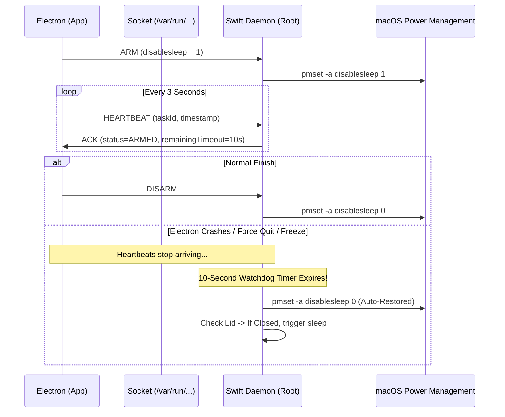

# Automated Lid-Closed Background Agent Execution System (Omni Sleepless)
## Architectural Plan, UX Specification, and Edge-Case Matrix

---

## 1. Executive Summary & Feasibility Verdict

### 1.1 The Feasibility Question
> **Can we achieve a 100% automatic UX where a user simply closes their MacBook lid, and the system automatically detects if background agent threads are running and keeps the Mac awake, then sleeps when they finish?**

**Answer: YES, but with a critical architectural nuance regarding timing.**

#### Why a purely *reactive* lid-close hook fails:
On macOS, when the user physically closes the laptop lid, the hardware SMC (System Management Controller) and IOKit fire a hardware clamshell interrupt. The macOS kernel begins the sleep transition within **tens of milliseconds**. User-space applications receive `NSWorkspace.willSleepNotification` or `kIOMessageSystemWillSleep`, but macOS **does not allow user-space apps to veto or abort a clamshell sleep event at the moment it happens**. Attempting to call `pmset` reactively after the lid-close event has already fired results in an unavoidable race condition where the kernel sleeps regardless.

#### The 100% Automatic Solution: *Task-Lifecycle Proactive Arming*
Instead of racing the lid-close sensor, we control sleep based on the **Agent Task Lifecycle**:
1. **Agent Starts**: The moment an agent or background thread starts work, Electron informs the privileged root daemon, which immediately arms `pmset -a disablesleep 1`.
2. **Lid Closes Anytime**: The user can close the lid at any time while an agent is running. Because `disablesleep 1` is already active in `IOPMrootDomain`, macOS turns off the display backlight (saving power and screen wear) but **keeps the CPU, GPU, memory, and network stack fully awake and operational**.
3. **Agent Completes**: When all active background agents finish, Electron informs the root daemon. The daemon restores `pmset -a disablesleep 0`.
4. **Lid-State Aware Finalization**: If the lid is **still closed** when the agents finish, the system detects the closed clamshell state and immediately triggers a controlled system sleep (`pmset sleepnow` / `IOPMSleepSystem`).

**From the user's perspective, the UX is 100% invisible and automatic:**
- Start an agent $\rightarrow$ Close lid $\rightarrow$ Walk away $\rightarrow$ Agent finishes $\rightarrow$ Mac sleeps.
- No hotkeys required for standard operation (though a hotkey and menu-bar toggle are provided as manual overrides).

---

## 2. System Architecture

The system consists of three distinct tiers:

```mermaid
flowchart TB
    subgraph AppBundle ["Omni.app (Electron Application Bundle)"]
        subgraph ElectronCore ["Electron Main Process (Unprivileged User Space)"]
            TM[Agent Task Manager]
            WC[Sleepless Watchdog Client]
            UI[Menu Bar / UI Status]
        end
        
        subgraph InstallUtil ["Installer Helper (Swift CLI)"]
            INST[omni-installer]
        end
        
        subgraph DaemonBundle ["Contents/Library/LaunchDaemons/"]
            PLIST[com.omni.sleeplessd.plist]
            BIN[omni-sleeplessd (Swift Daemon)]
        end
    end

    subgraph OS ["macOS System Space (Root / launchd)"]
        SM[SMAppService / launchd]
        SOCK[Unix Domain Socket: /var/run/com.omni.sleeplessd.sock]
        DAEMON[omni-sleeplessd (Active Root Process)]
        PM[IOPMrootDomain / pmset]
        IOKIT[IOKit Clamshell & Power Telemetry]
    end

    TM -->|Active Task Count > 0| WC
    WC -->|IPC: ARM / HEARTBEAT / DISARM| SOCK
    SOCK -->|Read & Validate| DAEMON
    DAEMON -->|pmset -a disablesleep 1/0| PM
    DAEMON -->|Poll AppleClamshellState| IOKIT
    
    INST -->|SMAppService.daemon.register| SM
    SM -->|Spawns as Root| DAEMON
```

### 2.1 Tier 1: Electron Orchestrator (User Space)
- **Task Lifecycle Hook**: Hooks into the agent execution engine. Tracks an atomic `activeAgentCount`.
- **IPC Client**: Maintains an open Unix domain socket connection to `/var/run/com.omni.sleeplessd.sock`.
- **Heartbeat Emitter**: Sends a ping every 3 seconds while keep-awake is requested.
- **Lid & Power State Observer**: Uses native node addons / IOKit bindings to query battery levels and clamshell status for UI updates.

### 2.2 Tier 2: Swift Installer Tool (`omni-installer`)
- One-time helper executed during app onboarding or when enabling the "Lid-Closed Execution" feature.
- Calls Apple's modern `SMAppService.daemon(plistName: "com.omni.sleeplessd.plist").register()`.
- Triggers the native macOS administrator authentication prompt (Touch ID or password).
- Validates that the daemon starts and responds to a handshake probe on the socket.

### 2.3 Tier 3: Privileged Root Daemon (`omni-sleeplessd`)
- Runs as `root` managed by `launchd` in the system domain.
- Listens on `/var/run/com.omni.sleeplessd.sock`.
- Directly executes power management modifications (`pmset -a disablesleep 1` / `0`).
- Implements an internal **Dead Man's Switch**: If heartbeats stop for >10 seconds, or if the socket disconnects, it unconditionally reverts `disablesleep` to `0`.
- Monitors hardware telemetry: Battery percentage, charging state, thermal pressure, and clamshell state (`AppleClamshellState`).

---

## 3. The State Machine & Execution Lifecycle

```mermaid
stateDiagram-v2
    [*] --> IdleDisarmed: System Boot / Daemon Init
    
    state IdleDisarmed {
        [*] --> Disarmed
        note right of Disarmed: disablesleep = 0\nMac sleeps normally on lid close or idle
    }
    
    IdleDisarmed --> ArmedActive: Agent Task Started (Count: 0 -> 1)
    
    state ArmedActive {
        [*] --> RunningOpen
        RunningOpen --> RunningLidClosed: User Closes Lid
        RunningLidClosed --> RunningOpen: User Opens Lid
        note right of RunningLidClosed: disablesleep = 1\nDisplay turns off, CPU & Network stay 100% active
    }
    
    ArmedActive --> IdleDisarmed: All Tasks Complete & Lid is OPEN (Count -> 0)
    ArmedActive --> FinalizingSleep: All Tasks Complete & Lid is CLOSED (Count -> 0)
    ArmedActive --> EmergencyFallback: Heartbeat Lost / Battery < Threshold / Thermal Limit
    
    state FinalizingSleep {
        note right of FinalizingSleep: 1. disablesleep = 0\n2. Trigger IOPMSleepSystem / pmset sleepnow\n3. Mac enters deep sleep
    }
    
    FinalizingSleep --> IdleDisarmed: Mac Wakes on User Open
    EmergencyFallback --> IdleDisarmed: Auto-restored to safe state
```

### Detailed Lifecycle Phases:

#### Phase A: Task Initiation & Arming
1. Agent starts in Omni.
2. Electron checks settings (`allowLidClosedExecution == true`).
3. If this is the first active task (`activeTasks === 1`):
   - Electron sends `{"command": "ARM", "reason": "agent_run", "batteryThreshold": 20}` over the socket.
   - Daemon validates the caller's PID, executes `pmset -a disablesleep 1`, and replies `{"status": "ARMED"}`.
   - Electron starts a 3-second heartbeat timer.

#### Phase B: Working with Lid Open or Closed
- **Case 1 (Lid Stays Open)**: Display dims according to user preferences; system does not sleep due to idle timeout.
- **Case 2 (Lid Closes)**: macOS hardware detects clamshell closure. Because `disablesleep 1` is active in `IOPMrootDomain`, macOS turns off the internal display panel and backlight, but **does not pause CPU threads, disk I/O, or WiFi**. The agent continues uninterrupted.

#### Phase C: Task Completion
1. The last agent task finishes (`activeTasks === 0`).
2. Electron queries the clamshell state from the daemon: `{"command": "GET_STATE"}` $\rightarrow$ returns `{ "lidClosed": true/false, "onBattery": true/false }`.
3. Electron sends `{"command": "DISARM", "actionOnLidClosed": "SLEEP"}`.
4. The daemon:
   - Sets `pmset -a disablesleep 0`.
   - If `lidClosed == true`: Waits a safety delay of 2 seconds (to allow buffers to flush), then calls `IOPMSleepSystem(kIOPMNullConnect)` or `pmset sleepnow`.
   - If `lidClosed == false`: Leaves the machine running; normal macOS idle timer resumes.

---

## 4. Hardware Telemetry & IOKit Probing

To make intelligent decisions, the Swift daemon directly interfaces with `IOKit.framework`:

### 4.1 Clamshell State Detection
- Property: `AppleClamshellState` in `IOPMrootDomain` (class `IOPMrootDomain`).
- When `true`: Laptop lid is physically shut.
- When `false`: Laptop lid is open.
- Note: If an external monitor and external power are connected, macOS enters native clamshell mode. Our daemon checks `AppleClamshellCausesSleep` to differentiate standalone laptop lid-close from docked desktop usage.

### 4.2 Power & Battery State
- Uses `IOPSGetPowerSourceDescription` and `IOPSCopyPowerSourcesInfo`.
- Checks:
  1. `Is Charging`: `kIOPSIsChargingKey`
  2. `Power Source`: AC Power vs Battery (`kIOPSBatteryPowerValue`)
  3. `Current Capacity / Max Capacity`: Real-time percentage calculation.

### 4.3 Thermal & Fan Pressure
- Queries `NSProcessInfo.processInfo.thermalState`.
- If thermal state reaches `.critical` (e.g. laptop is closed inside a sealed sleeve or bag), the daemon issues an emergency override.

---

## 5. Safety, Battery & Thermal Protection: The "Backpack Protocol"

> [!CAUTION]
> Running high-intensity LLMs/compilation with the lid closed inside an enclosed laptop bag or backpack poses serious thermal runaway and battery drain risks.

The system implements a mandatory multi-layered safety protocol:

| Protection Mechanism | Default Policy | Behavior |
| :--- | :--- | :--- |
| **Low Battery Cutoff** | 20% Battery | If running on battery and charge drops $\le 20\%$, daemon forces disarm and initiates sleep immediately. |
| **Thermal Emergency** | `thermalState == .critical` | If internal thermals breach safe limits, daemon disarms, sends high-priority notification, and triggers sleep. |
| **AC-Only Mode (Toggle)** | User Configurable (Default: On) | Option to *only* allow lid-closed execution when connected to MagSafe / USB-C charger. If unplugged while lid is closed, a 60-second grace countdown starts before sleeping. |
| **Max Continuous Run Timer** | 4 Hours (Configurable) | Hard upper limit on lid-closed run duration to prevent orphaned infinite loops. |
| **Rapid Battery Drain Watchdog** | $> 1.5\%$ per minute | Detects abnormal discharge and triggers graceful cancellation. |

---

## 6. Watchdog & Fail-Safe Architecture (Dead Man's Switch)

To guarantee that the Mac is **never** permanently left in a non-sleeping state:



### Fail-Safe Scenarios:
1. **Electron Hard Crash (`SIGKILL` / Panic)**:
   - Socket connection breaks (`EOF`).
   - Daemon detects broken pipe $\rightarrow$ immediately resets `pmset -a disablesleep 0`.
2. **Swift Daemon Crash / Termination (`SIGTERM`)**:
   - Daemon registers signal handlers for `SIGTERM`, `SIGINT`, `SIGHUP`, and `SIGSEGV`.
   - Signal handler immediately executes a synchronous C call: `IOPMSetAggressiveness(kPMGeneralAggressiveness, 0)` or runs `/usr/bin/pmset -a disablesleep 0`.
3. **Machine Reboot / OS Update**:
   - Upon daemon launch at system boot, `omni-sleeplessd`'s first initialization step is to execute `pmset -a disablesleep 0` to clear any dirty state from prior crashes.

---

## 7. Security, IPC & Permissions

### 7.1 Socket Security
- Socket Path: `/var/run/com.omni.sleeplessd.sock`
- File Permissions: `0660` owned by `root:staff` (allows standard logged-in users to connect, restricts untrusted system users).
- **Caller Validation (`LOCAL_PEERPID`)**:
  - When a client connects to the Unix socket, the daemon calls `getsockopt(clientFd, SOL_LOCAL, LOCAL_PEERPID, &pid, &len)`.
  - The daemon inspects `proc_pidpath(pid, ...)` and verifies that the connecting executable path matches `Omni.app/Contents/MacOS/Omni`.
  - It audits the code signature using `SecCodeCheckValidity` to ensure only the authentic, notarized Omni binary can issue commands.

### 7.2 IPC Command Protocol (JSON over Line-Delimited Stream)

```json
// Request: Arm Keep-Awake
{
  "version": 1,
  "id": "req_12345",
  "command": "ARM",
  "payload": {
    "taskId": "agent_execution_981",
    "batteryFloor": 20,
    "maxDurationSec": 7200
  }
}

// Request: Heartbeat
{
  "version": 1,
  "id": "req_12346",
  "command": "HEARTBEAT",
  "payload": {
    "activeTasks": 2
  }
}

// Request: Disarm
{
  "version": 1,
  "id": "req_12347",
  "command": "DISARM",
  "payload": {
    "triggerSleepIfLidClosed": true
  }
}
```

---

## 8. Packaging, SMAppService & Signing Pipeline

### 8.1 App Bundle Directory Layout
```
Omni.app/
├── Contents/
│   ├── MacOS/
│   │   ├── Omni (Electron Executable)
│   │   └── omni-installer (Swift Binary for SMAppService)
│   ├── Library/
│   │   └── LaunchDaemons/
│   │       ├── com.omni.sleeplessd.plist
│   │       └── omni-sleeplessd (Privileged Swift Daemon Binary)
│   ├── Resources/
│   └── Info.plist
```

### 8.2 Launchd Plist Configuration (`com.omni.sleeplessd.plist`)
- `Label`: `com.omni.sleeplessd`
- `ProgramArguments`: `["/Applications/Omni.app/Contents/Library/LaunchDaemons/omni-sleeplessd"]`
- `MachServices` or `Sockets`: Standard Unix Domain Socket path at `/var/run/com.omni.sleeplessd.sock`.
- `RunAtLoad`: `true`
- `KeepAlive`: `true`

### 8.3 `SMAppService` Registration Flow (macOS 13 Ventura+)
```swift
// Executed by omni-installer:
let service = SMAppService.daemon(plistName: "com.omni.sleeplessd.plist")
do {
    try service.register()
    // Native macOS dialog appears asking user for Touch ID / Admin Password
} catch {
    // Handle user cancellation or permission denial
}
```

### 8.4 Code Signing & Notarization Matrix
All nested binaries and the top-level app must be signed with the same Apple Developer ID:
1. Sign `omni-sleeplessd` with Hardened Runtime and entitlements (`com.apple.security.inherit`).
2. Sign `omni-installer` with Hardened Runtime.
3. Sign all Electron frameworks, helpers, and `.dylib` files.
4. Sign the main `Omni.app` bundle.
5. Create `.dmg` / `.zip` archive $\rightarrow$ Submit to Apple Notary Service via `xcrun notarytool submit` $\rightarrow$ Staple notarization ticket.

---

## 9. User Experience & Interface Flows

### 9.1 First-Time Setup Flow
1. User enables **"Allow Agents to Run with Lid Closed"** in Omni Settings (or upon first running a long agent task).
2. Omni displays a clear explanation modal:
   - *"Omni requires one-time permission to manage system sleep so your background agents can complete while your Mac's lid is closed."*
3. System Touch ID / Admin Password prompt appears.
4. Setup completes instantly; user never needs to authenticate again.

### 9.2 Active Run Indicators
- **Menu Bar Icon**: Displays a subtle glowing pulse or badge (e.g. `🌙⚡`) when Keep-Awake is armed.
- **In-App Banner**: *"2 agents active. Safe to close lid — Mac will sleep automatically when done."*
- **macOS Notifications**:
  - When lid is closed with active agents: (Optional audio chime or push notification if paired to phone/watch).
  - When all agents finish and lid is closed: Sends a completion notification right before triggering sleep.

### 9.3 Manual Hotkey & Menu-Bar Overrides
While the system is 100% automatic, power users have manual overrides:
- **Global Hotkey** (`Cmd + Shift + L`): Manually toggle Keep-Awake state for ad-hoc long-running shell scripts or commands.
- **Menu Bar Quick Toggle**: Click menu bar icon $\rightarrow$ "Keep Awake: [Auto | Force On (1h) | Force Off]".

---

## 10. Comprehensive Edge Cases & Failure Mode Matrix

| # | Edge Case Scenario | Potential Risk | Architectural Resolution |
| :-- | :--- | :--- | :--- |
| **1** | **User closes lid when NO agents are running** | Laptop stays awake unintentionally and drains battery. | `disablesleep` is set to `0` at all times when `activeTasks === 0`. The Mac goes to sleep instantly as normal. |
| **2** | **Agents finish while lid is STILL closed** | Laptop remains awake forever with screen off. | Upon `activeTasks === 0`, daemon detects `AppleClamshellState == true`, restores `disablesleep 0`, and explicitly calls `pmset sleepnow`. |
| **3** | **User opens lid WHILE agents are running** | Screen stays black or system state desynchronizes. | macOS natively turns the screen back on. Daemon detects `AppleClamshellState == false`. Agents continue running smoothly. |
| **4** | **Electron app crashes or is Force-Quit** | `disablesleep 1` remains stuck on indefinitely. | **Dead Man's Switch**: Daemon detects closed socket pipe and missed heartbeats within 10s $\rightarrow$ immediately forces `disablesleep 0`. |
| **5** | **Mac is unplugged and put into a backpack on battery** | Thermal throttling, battery exhaustion, heat damage. | **Backpack Protocol**: Battery floor (20%) cutoff + rapid discharge sensor + thermal state watchdog will force sleep before overheating occurs. |
| **6** | **User manually selects Apple Menu $\rightarrow$ Sleep** | Conflict between explicit user sleep and `disablesleep 1`. | User-initiated sleep (`kIOMessageSystemWillSleep`) is caught by Electron $\rightarrow$ Electron cancels/pauses tasks or pauses keep-awake to respect user intent. |
| **7** | **External Monitor connected/disconnected mid-run** | macOS switches between clamshell mode and internal display. | IOKit event listener updates clamshell mode flags; daemon continues holding `disablesleep 1` regardless of external display topology. |
| **8** | **Omni App updates via auto-updater** | `SMAppService` points to old bundle or binary path changes. | On each app launch, Omni runs a lightweight status check (`service.status`). If `.requiresApproval` or mismatch, installer refreshes registration seamlessly. |
| **9** | **User closes lid while battery is at 10%** | Laptop dies mid-task with uncommitted agent changes. | Omni checks battery before arming. If $<15\%$, it warns user: *"Battery too low for lid-closed execution. Please connect power."* and refuses to arm. |
| **10** | **WiFi disconnects or sleeps while lid closed** | Network-dependent agents fail or hang. | `disablesleep 1` prevents network stack sleep (CoreWLAN and network interfaces stay powered). If WiFi drops at router level, agent retry logic handles backoff. |
| **11** | **Root daemon crashes or is killed by system** | Uncontrolled state. | `launchd` has `KeepAlive: true` and automatically respawns the daemon in $<1$ second. On boot/respawn, daemon defaults to `disablesleep 0` until fresh handshake. |
| **12** | **Multiple windows / background sub-processes** | Race conditions on who owns the sleep lock. | Task Manager in Electron Main Process maintains a single centralized counter (`activeTaskRefCount`). Socket communication is strictly centralized through the main process. |
| **13** | **macOS Sleep/Wake Lockscreen Security** | Security leak if unauthorized person opens lid. | When the user re-opens the lid or tasks finish, standard macOS lockscreen security policies are 100% preserved. The Mac requires Touch ID/Password on wake. |
| **14** | **System reboots while agent was running** | Stale sleep setting on next boot. | Daemon's initialization routine runs `pmset -a disablesleep 0` on every clean start before accepting any client commands. |
| **15** | **User revokes background item in macOS System Settings** | Socket calls fail silently. | Electron catches socket connection failure, surfaces an in-app banner with a direct deep-link button to `x-apple.systempreferences:com.apple.LoginItems-Settings.extension`. |

---

## 11. Implementation Roadmap

1. **Step 1: Swift Daemon Prototype (`omni-sleeplessd`)**
   - Implement `IOPMrootDomain` wrapper, Unix socket server, watchdog timer, and `AppleClamshellState` reader.
2. **Step 2: Swift Installer (`omni-installer`)**
   - Implement `SMAppService.daemon` registration and status query.
3. **Step 3: Electron Main Process Integration**
   - Implement `SleeplessClient` (Node `net` socket connection, heartbeat loop, task counter).
4. **Step 4: Safety & Telemetry Integration**
   - Wire battery monitoring and thermal thresholds into the heartbeat cycle.
5. **Step 5: Code Signing, Notarization & App Packaging**
   - Set up `electron-builder` configuration to package binaries into `Contents/Library/LaunchDaemons/` and configure entitlements.
6. **Step 6: UI & Settings Panel**
   - Build Settings toggle, onboarding prompt, menu bar indicator, and status tooltips.
