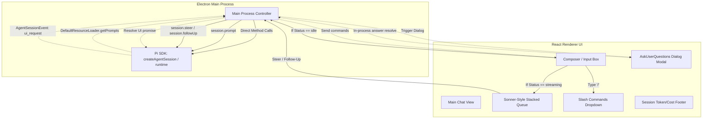

# Master Pi-Agent Integration & Queue Plan for pipper (Pipper)

This plan details how we will integrate the `pi-agent` SDK directly into pipper, focusing on message sending, the agentic steering queue, slash commands autocomplete, handling in-process events, and constructing message blocks from thread JSONL logs.

---

## Design System & Component Constraints

> [!IMPORTANT]
> **Strict Reusability Rule:** All visual elements, dialogs, widgets, lists, dropdowns, and buttons must be built using the **existing UI components** already present in the codebase (e.g. `<Button>`, `<Dropdown>`, `<MenuItem>`, `<Tabs>`, `<TabItem>`, `<TabPanel>`, `<Select>`, `<Tooltip>`, `<Accordion>`, `<FileThumbnail>`, `<ThinkingSteps>`, `<ThinkingIndicator>`).
>
> **No Custom Creation:** Do not build custom button styles, dropdowns, select wrappers, or scroll containers.
>
> **Design Tokens Compliance:** Follow the design tokens defined in `src/index.css` (surface classes `surfaceClasses(N, N)`, fontWeights, springs, color variables).

---

## Proposed Architecture



---

## 1. Input Composer Capabilities (Queue & History)

We will modify `@/components/ui/input-message.tsx` to support history recall and inline queue management out of the box.

### History Recall (ArrowUp / ArrowDown)

- **API Props:**
  - `history?: string[]` (List of sent prompts, oldest first).
- **Behavior:**
  - When the textarea is focused and the cursor is at the first line (character offset `0`), pressing `ArrowUp` recalls the previous prompt in the history list.
  - Pressing `ArrowDown` at the last line (character offset at length) walks forward toward the in-progress draft.
  - We cache the user's active draft so it can be restored if they scroll back down.
  - Any edit (typing/pasting) or sending action exits history mode.

### Inline Message Queueing

- **API Props:**
  - `status?: "idle" | "streaming"` (Controlled status of the active session).
  - `queue?: QueuedMessage[]` (Controlled list of pending prompts: `{ id, text, files }`).
  - `onQueueChange?: (queue: QueuedMessage[]) => void` (Triggered on edit, remove, reorder, or enqueue).
  - `showQueue?: boolean` (Toggle display of the built-in queue cards above the input field, default `true`).
- **Behavior:**
  - If `status === "streaming"`, clicking Send or pressing `Enter` intercepts the prompt, packages it as a `QueuedMessage`, and appends it via `onQueueChange` instead of triggering `onSend`.
  - If `status === "idle"`, prompt is sent immediately via `onSend`.
  - If `showQueue` is true, the queue is rendered above the input area:
    - **Drag or Alt+Up/Down:** Shifts prompt index order.
    - **Double-click, Enter, or F2:** Removes the card from the queue and loads its text back into the composer textarea for editing.
    - **Close (✕) or Delete:** Discards the card from the queue.

---

## 2. Slash Commands Autocomplete

We will support command auto-completion directly inside the input message composer when the user types a leading slash (`/`).

### Command Discovery

- The Electron main process queries available commands programmatically using the SDK's `DefaultResourceLoader`:
  ```typescript
  import { DefaultResourceLoader } from "@earendil-works/pi-coding-agent";
  const loader = new DefaultResourceLoader({ cwd, agentDir });
  await loader.reload();
  const prompts = loader.getPrompts();
  const skills = loader.getSkills();
  const extensions = loader.getExtensions();
  ```
- These are mapped into a unified command list containing:
  - `name`: Command name (e.g. `/fix-tests` or `/skill:brave-search`).
  - `description`: Explanatory text.
  - `source`: `"extension" | "prompt" | "skill"`.
- This list is exposed to the React frontend through a renderer bridge API: `window.pipper.pi.getCommands()`.

### Autocomplete Popover UI

- **Trigger:** Typing `/` as the first character in the `InputMessage` composer.
- **Filtering:** As the user types after the slash (e.g. `/fi`), the dropdown filters the list to matches (e.g. `/fix-tests`).
- **Visual Styling:**
  - Rendered as a floating popover positioned absolutely above the input textarea.
  - Curated lists separating commands by source (`Skills`, `Prompt Templates`, `Extensions`).
  - Displays the command name on the left, and source/description on the right.
- **Keyboard Navigation:**
  - `ArrowUp` / `ArrowDown`: Move the active selection index in the list.
  - `Enter` / `Tab`: Auto-complete the input with the selected slash command (e.g., replaces `/fi` with `/fix-tests `) and returns focus to the textarea.
  - `Escape` or clicking outside: Closes the autocomplete dropdown.

---

## 3. Session JSONL Log Parsing & Rendering

Thread logs read from `~/.pi/agent/sessions/--<path>--/*.jsonl` contain specific message objects. To parse and manage these logs programmatically, we utilize the SDK's `SessionManager` tree traversal APIs.

### Compaction Traversal & Rendering

- **Algorithm:** When reading the path from leaf to root using `sm.getPath()`:
  - If a `compaction` entry is encountered:
    - Extract the compaction `summary` and `firstKeptEntryId`.
    - Display a dedicated **Compaction Summary Card** in the UI.
    - Truncate/hide all conversation messages that occurred before `firstKeptEntryId` on that path (optionally keeping them accessible inside a collapsed "Show compacted history" accordion).
    - Render only the messages starting from `firstKeptEntryId` onwards.
  - **Events:** Sync this state when a `compaction_start` or `compaction_end` event is received in the event subscriber.

### UserMessage

- **Schema:** `{"role": "user", "content": "...", "timestamp": ..., "attachments": []}`
- **Rendering:** Displayed as a user chat message bubble aligned to the right. Attachments (base64 encoded images or files) are listed under the text prompt as small hover-expandable `<FileThumbnail>` nodes.

### AssistantMessage

- **Schema:**
  ```json
  {
    "role": "assistant",
    "content": [
      { "type": "text", "text": "Hello!" },
      { "type": "thinking", "thinking": "Deciding step..." },
      { "type": "toolCall", "id": "call_123", "name": "bash", "arguments": { "command": "ls" } }
    ],
    "model": "claude-sonnet-4-20250514",
    "timestamp": 1733234567890
  }
  ```
- **Rendering:** Iterated block-by-block inside a left-aligned assistant chat container:
  - `type: "text"`: Rendered as formatted markdown text via `Streamdown`.
  - `type: "thinking"`: Rendered inside a collapsible `<ThinkingSteps>` block.
  - `type: "toolCall"`: Rendered as an item in the active `<ThinkingSteps>` trace.

### ToolResultMessage

- **Schema:**
  ```json
  {
    "role": "toolResult",
    "toolCallId": "call_123",
    "toolName": "bash",
    "content": [{ "type": "text", "text": "output..." }],
    "isError": false
  }
  ```
- **Rendering:** Correlated to the original `toolCall` block using the `toolCallId` and rendered inside the corresponding `<ThinkingStep>` node:
  - Transitions the active step's status badge to `"complete"` or `"error"` (if `isError` is true, highlighted in red).
  - If it contains terminal console output (e.g. `toolName === "bash"`), it is rendered as an embedded terminal logs console box inside the step.

### BashExecutionMessage

- **Schema:**
  ```json
  {
    "role": "bashExecution",
    "command": "ls -la",
    "output": "total 48...",
    "exitCode": 0,
    "cancelled": false
  }
  ```
- **Rendering:** Rendered inline as a `<ThinkingStep>` node inside the `<ThinkingSteps>` trace deck:
  - **Header:** Displays `icon="terminal"`, the command string as the label (truncated if long, with full text available on hover), and status text reflecting the outcome (e.g., `completed`, `exit code <N>`, or `cancelled`).
  - **Content:** An embedded terminal-styled console container showing the accumulated stdout/stderr output.
  - **Status:** Maps to complete, error (if exitCode !== 0), or warning/pending.

### Custom & Extension Message Entries (`custom_message` / `custom`)

- **`custom_message` Entry:** Represents extension-injected content that participates in LLM context.
  - **Rendering:** If `display === true`, render inline in the chat flow with a distinct border style indicating it came from an extension.
- **`custom` Entry:** Represents extension state persistence. It is ignored during rendering and context building.

### Label Entries (Bookmarks / Checkpoints)

- **Schema:** `{"type": "label", "targetId": "msg_id", "label": "checkpoint-1"}`
- **Rendering:** Display a small bookmark badge next to the message corresponding to `targetId` showing the `label` text. If `label` is cleared/undefined, remove the badge.

### Branch Summary Entries (`branch_summary`)

- **Schema:** `{"type": "branch_summary", "fromId": "common_ancestor_id", "summary": "..."}`
- **Rendering:** Rendered as a system information block indicating that the user switched branches, presenting the LLM-generated summary of what was completed/explored on the abandoned path.

---

## 4. SQLite DB vs. JSONL Disk Files Synchronization

We use a hybrid storage approach to maintain synchronization with both our application's UI structure and the global CLI:

### What We Store in SQLite Database

We store configuration and relation metadata inside our local `sqlite` database to allow instant rendering of lists and workspaces:

1. **Projects Table:** `id`, `name`, `path`, `icon`. (Where `path` is the absolute workspace directory).
2. **Threads Table:** `id`, `project_id`, `title`, `session_file_path`, `updated_at`. (Links the project to the target `.jsonl` session file path on disk).
3. **Messages Table:** Left **unused**. Conversation messages themselves are **never** synced back to SQLite to prevent conflicts.

### Reading Session Data From Disk & Display Name Extraction

- **Session Directory Discovery:**
  - When a project is active, we resolve its absolute directory path into the encoded format expected by the `pi` CLI (converting all slashes to hyphens and wrapping in double hyphens):
    - _Example:_ `/Users/username/myproject` resolves to the folder `~/.pi/agent/sessions/--Users-username-myproject--/`
  - We read the files in this directory via the SDK's `SessionManager.list(cwd)` to discover active threads.
- **Title / Display Name Syncing:**
  - When constructing the thread list, the display name is resolved from the latest `session_info` entry's `name` field in the session.
  - If no `session_info` entry is found, we fall back to a truncated version of the first `user` role message. If the thread is entirely empty, fall back to the timestamp name.
  - We cache this title in the SQLite `threads` table for instantaneous rendering.
- **Conversation List Construction:**
  - When a thread is clicked, we call `runtime.switchSession(session_file_path)` to load the thread.
  - We build the active path from the leaf to the root using `sm.getPath()`, filtering out compacted messages, and parse/render the remaining entries dynamically in React.

### Thread Deletion

- When a user deletes a thread in the UI:
  - Delete the corresponding `.jsonl` file from the disk directory (optionally utilizing the system trash via the `trash` module if available).
  - Remove the corresponding record from the SQLite `threads` table.

---

## 5. SDK Session Initialization & Event Subscriptions

In the Electron main process, we import the SDK modules directly and manage the agent sessions in-process:

### Spawning and Initialization

```typescript
import {
  createAgentSessionRuntime,
  SessionManager,
  AuthStorage,
  ModelRegistry,
} from "@earendil-works/pi-coding-agent";

const authStorage = AuthStorage.create();
const modelRegistry = ModelRegistry.create(authStorage);

// Initialize the session runtime
const runtime = await createAgentSessionRuntime(createRuntime, {
  cwd: activeProjectPath,
  agentDir: "~/.pi/agent",
  sessionManager: SessionManager.create(activeProjectPath),
});
```

### Event Streaming Subscriber

Instead of reading a terminal stream, we attach a listener directly to the session object:

```typescript
function attachEventSubscriber(session: AgentSession) {
  return session.subscribe((event) => {
    try {
      // Send event through IPC to React Renderer
      mainWindow.webContents.send("pi:event", event);
    } catch (err) {
      console.error("Failed to forward session event:", event, err);
    }
  });
}

// Ensure to re-subscribe and re-bind extensions whenever the active session changes
let unsubscribe = attachEventSubscriber(runtime.session);
```

### Sending Inputs & Abort Commands

- **Prompt:** Call `prompt` directly:
  ```typescript
  await runtime.session.prompt(promptText);
  ```
- **Abort:** If the user interrupts or stops streaming:
  ```typescript
  await runtime.session.abort();
  ```

---

## 6. Extension UI Protocol & Dialog Handling

Extensions running inside the agent can request interactive dialogs or issue fire-and-forget UI updates. These are received as standard events on the session subscription callback.

### Interactive Dialogs (Requires Response)

When a dialog request event is received in the subscriber, we map it directly to the existing `@/components/ui/ask-user-questions.tsx` (`<AskUserQuestions>`) component and render it as an overlay modal. Because the SDK is in-process, we intercept the request, open the UI, and return the resolved response back to the execution queue:

1. **`select`**
   - _Request:_ `{"type": "ui_request", "method": "select", "title": "Allow dangerous command?", "options": ["Allow", "Block"]}`
   - _Mapping:_
     ```typescript
     const question: AskUserQuestion = {
       id: id,
       title: title,
       options: options.map((opt) => ({ id: opt, title: opt })),
       multiSelect: false,
       skippable: false,
     };
     ```
2. **`confirm`**
   - _Request:_ `{"type": "ui_request", "method": "confirm", "title": "Clear session?", "message": "All messages will be lost."}`
   - _Mapping:_
     ```typescript
     const question: AskUserQuestion = {
       id: id,
       title: title + (message ? `\n\n${message}` : ""),
       options: [
         { id: "yes", title: "Yes" },
         { id: "no", title: "No" },
       ],
       multiSelect: false,
       skippable: false,
     };
     ```
3. **`input`**
   - _Request:_ `{"type": "ui_request", "method": "input", "title": "Enter a value", "placeholder": "..."}`
   - _Mapping:_
     ```typescript
     const question: AskUserQuestion = {
       id: id,
       title: title,
       options: [],
       allowOther: true,
       otherPlaceholder: placeholder || "Type your input...",
       skippable: false,
     };
     ```
4. **`editor`**
   - _Request:_ `{"type": "ui_request", "method": "editor", "title": "Edit some text", "prefill": "..."}`
   - _Mapping:_
     ```typescript
     const question: AskUserQuestion = {
       id: id,
       title: title,
       options: [],
       allowOther: true,
       otherPlaceholder: "Type your multi-line edit...",
       skippable: false,
     };
     const defaultAnswers = {
       [id]: { questionId: id, selectedIds: [], otherText: prefill },
     };
     ```

### Fire-and-Forget UI Updates (No Response Needed)

1. **`notify`**
   - _Payload:_ `{"type": "ui_request", "method": "notify", "message": "...", "notifyType": "warning"}`
   - _UI:_ Display a Sonner notification toast corresponding to the `notifyType` (`info` = default, `warning` = orange, `error` = red).
2. **`setTitle`**
   - _Payload:_ `{"type": "ui_request", "method": "setTitle", "title": "..."}`
   - _UI:_ Send an IPC event to update the title bar label, updating the SQLite thread title cache at the same time.
3. **`set_editor_text`**
   - _Payload:_ `{"type": "ui_request", "method": "set_editor_text", "text": "..."}`
   - _UI:_ Replace the active text in the composer `<textarea>` with the prefilled text.

---

## 7. Error & Title Bar Handling

### Error Toast Notifications

- Whenever a session action throws or triggers a failure callback (e.g. model switching failures or validation errors):
  We catch this in Electron Main and dispatch it to the renderer as a red toast alert showing the parsed `error` string.

### Title Bar & Tab Navigation States

- **Dynamic Thread & Tab Title Updates:** The thread name within the tab view, sidebar navigation list, and main window title is dynamically updated using the active session/thread name. All hardcoded mock titles (such as "omni thread" or similar mock strings) are replaced.
- **Preserve Project Icons:** Project icons must be preserved exactly as configured in the SQLite database and should never be overwritten or changed during dynamic title updates.
- **Agent Start (`agent_start`):** Upon execution start, we change the window title bar in the React header (and/or the BrowserWindow frame title) to append a status badge: `"{project} (Running...)"`.
- **Agent End (`agent_end`):** Upon execution completion, we restore the title back to its resting state: `"{project}"`.
- **Dynamic Extension Override (`setTitle`):** If an extension triggers a `setTitle` request, the title (including tab/view titles) is updated to the explicit string requested by the extension.

---

## 8. Tool Renderers & Thinking State

We will strictly render active execution steps and thinking logs using the `<ThinkingSteps>` and `<ThinkingIndicator>` components:

### Active Loading State

- When the agent is in streaming/thinking mode, we will display the `<ThinkingIndicator>` inline as the active processing indicator.

### Reasoning and Execution Trace (`<ThinkingSteps>`)

We structure the events into accordion-collapsible trace decks using this exact layout style:

```tsx
<ThinkingSteps open={open} onOpenChange={setOpen}>
  <ThinkingStepsHeader>Research Agent</ThinkingStepsHeader>
  <ThinkingStepsContent>
    {/* Map of parsed tool execution steps */}
    <ThinkingStep
      index={index}
      icon={iconName}
      label={stepLabel}
      description={stepDescription}
      status={status} // "active" | "complete" | "pending"
      isLast={isLast}
    >
      {/* If search step, display sources badges */}
      <ThinkingStepSources>
        <ThinkingStepSource>x.com</ThinkingStepSource>
        <ThinkingStepSource>github.com</ThinkingStepSource>
      </ThinkingStepSources>

      {/* If screenshot or layout output, display preview image */}
      <ThinkingStepImage src={imageSrc} caption={imageCaption} />

      {/* If multi-line files details, display nested details list */}
      <ThinkingStepDetails summary={detailsSummary} details={detailsLinesArray} />
    </ThinkingStep>
  </ThinkingStepsContent>
</ThinkingSteps>
```

### Event Type to Icon Mappings

- Web search: `icon="search"` or `icon="globe"`
- Code/file manipulations: `icon="dot"` or `icon="brain"`
- Final completions: `icon="check"`

---

## 9. Dynamic Model Config & Switching

- **Model Listing:** Query the `ModelRegistry` directly via `modelRegistry.getAvailable()` to populate the frontend selection dropdown with models that have active credentials.
- **Reasoning Config:** Switch model using `session.setModel(model)` or adjust thinking depth using `session.setThinkingLevel(level)` or `session.cycleThinkingLevel()`.
- **Graceful Fallbacks:** If a model fails or becomes unavailable, catch the error, toast the user, and automatically invoke `session.cycleModel()` to try the next available provider model.

---

## 10. Event Reference & UI State Mapping

The `AgentSession` streams events directly to the subscriber. We parse and map these events to the React state and component behaviors:

### Lifecycle & Session State Events

- **`agent_start`** `{"type": "agent_start"}`
  - _UI Action:_ Transition UI status to `"streaming"`. Disable composer submit (divert inputs to the visual queue stack). Update window title bar.
- **`agent_end`** `{"type": "agent_end", "messages": [...]}`
  - _UI Action:_ Transition UI status to `"idle"`. Read any generated messages. Automatically dispatch the next item in the visual queue (if any). Reset window title bar. Update token/cost footer info.
- **`turn_start`** `{"type": "turn_start"}`
  - _UI Action:_ Initialize list of thinking/tool cards for this specific turn.
- **`turn_end`** `{"type": "turn_end", "message": {...}, "toolResults": [...]}`
  - _UI Action:_ Finalize display of assistant message and tool outputs for this turn.
- **`message_start`** `{"type": "message_start", "message": {...}}`
  - _UI Action:_ Append a new message block in the chat stream.
- **`message_end`** `{"type": "message_end", "message": {...}}`
  - _UI Action:_ Finalize message text and freeze token accumulator.

### Streaming Delta Events

- **`message_update`** `{"type": "message_update", "message": {...}, "assistantMessageEvent": {...}}`
  - Check the nested `assistantMessageEvent.type`:
    - `start` / `text_start`: Initialize the text response container.
    - `text_delta`: Stream raw tokens to `<ChatMessage>` using `Streamdown`.
    - `text_end`: Finalize markdown layout rendering.
    - `thinking_start`: Create and open the collapsible thinking trace container.
    - `thinking_delta`: Stream reasoning tokens into the active `<ThinkingIndicator>` or thoughts box.
    - `thinking_end`: Close the thinking trace wrapper or set to completed state.
    - `toolcall_start` / `toolcall_delta` / `toolcall_end`: Show card showing pending tool arguments, moving to active execution card once `tool_execution_start` fires.

### Tool Execution Events

- **`tool_execution_start`**

  ```json
  {
    "type": "tool_execution_start",
    "toolCallId": "call_abc123",
    "toolName": "bash",
    "args": { "command": "ls" }
  }
  ```

  - _UI Action:_ Instantiate a new step in `<ThinkingSteps>`. If `toolName === "bash"`, open the terminal log panel showing the run command.

- **`tool_execution_update`**

  ```json
  {
    "type": "tool_execution_update",
    "toolCallId": "call_abc123",
    "toolName": "bash",
    "partialResult": { "content": [{ "type": "text", "text": "stdout..." }] }
  }
  ```

  - _UI Action:_ Replace the contents of the step/terminal card with the accumulated `partialResult.content[0].text`.

- **`tool_execution_end`**

  ```json
  {"type": "tool_execution_end", "toolCallId": "call_abc123", "toolName": "bash", "result": {...}, "isError": false}
  ```

  - _UI Action:_ Mark the execution card as completed (or red/error if `isError` is true).

### System & Control Events

- **`queue_update`** `{"type": "queue_update", "steering": [...], "followUp": [...]}`
  - _UI Action:_ Sync the visual Sonner card queue stack with the exact array contents of `steering` and `followUp` lists.
- **`compaction_start`** `{"type": "compaction_start", "reason": "threshold"}`
  - _UI Action:_ Display inline notification: _"Compacting thread context to fit context window..."_
- **`compaction_end`**

  ```json
  {
    "type": "compaction_end",
    "result": { "summary": "...", "firstKeptEntryId": "abc123" },
    "aborted": false
  }
  ```

  - _UI Action:_ Re-render message log from the specified `firstKeptEntryId` to clean up old compacted entries.

- **`auto_retry_start`**

  ```json
  { "type": "auto_retry_start", "attempt": 1, "maxAttempts": 3, "errorMessage": "Overloaded" }
  ```

  - _UI Action:_ Show transient status toast: _"Provider overloaded. Retrying (Attempt 1/3)..."_

- **`auto_retry_end`** `{"type": "auto_retry_end", "success": true}`
  - _UI Action:_ Dismiss the retry status toast.
- **`extension_error`** `{"type": "extension_error", "extensionPath": "...", "error": "..."}`
  - _UI Action:_ Render extension error details inline as a warning banner.

---

## 11. Performance & Thread Optimization

- **Virtualization:** Use `@tanstack/react-virtual` to window large message logs and stdout streams.
- **Incremental Markdown:** Render text streams dynamically using `Streamdown`.
- **Subprocess Swapping (Project Level):** Maintain a cache of active project `AgentSessionRuntime` objects. Instantly switch projects by swapping the active runtime reference and resetting event bindings.
- **Session Thread Swapping (Thread Level):**
  - When swapping threads _within the same project_, instead of re-spawning a process, we call the runtime's session switching API directly:
    ```typescript
    await runtime.switchSession(targetSessionFilePath);
    ```
  - This permits near-instant swapping. If blocked by an extension, display a caution toast notification.

---

## 12. Real-Time Status & Statistics Footer

We will implement a sleek, secondary footer bar at the bottom of the main chat view (matching the design system colors and typography) to display token usage and costs:

- **Trigger:** Fetched by calling session status properties at the end of each turn (`agent_end` or `turn_end`).
- **Visual Information:**
  - **Tokens Bar:** A progress indicator displaying context window usage percentage.
  - **Session Cost:** Displays current session cost.
  - **Activity Indicators:** Messages and tool counts.
- **Compaction state:** If compaction has just completed, hide or display "Compacting..." until fresh stats are provided.
