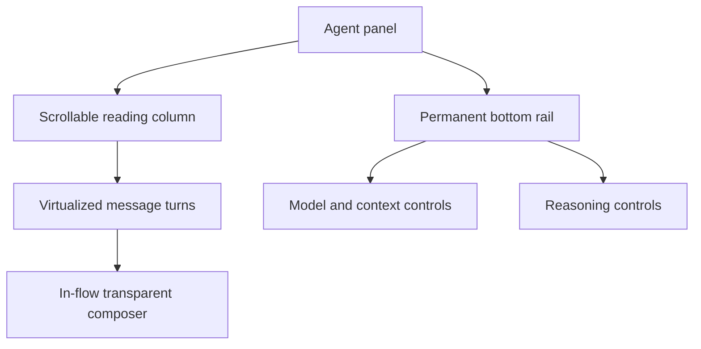

# Agent Panel Redesign

This document maps the redesigned agent conversation UI to its implementation. Use it to find the correct component before changing layout, styling, or behavior.

The redesign is presentation-only at its boundaries: ACP session state, message delivery, drafts, editing, `/continue`, slash commands, mentions, attachments, model selection, reasoning selection, context usage, queues, and trace hydration still use their existing stores and handlers.

## UI vocabulary

The agent panel has two separate composer-related regions:

1. **In-flow composer** — the transparent text input placed after the latest conversation turn. It belongs to the conversation scroll container and moves down as messages are added.
2. **Permanent composer rail** — the non-scrolling bottom row containing the model picker, context usage, and reasoning picker.

Do not combine these regions. Moving the permanent rail into the conversation scroll container makes runtime controls scroll away. Moving the in-flow composer outside the scroll container pins the input to the viewport instead of placing it after the latest turn.



## Primary ownership map

| What you want to change                                                                                                  | Primary file                                    | Component or symbol                                                                |
| ------------------------------------------------------------------------------------------------------------------------ | ----------------------------------------------- | ---------------------------------------------------------------------------------- |
| Overall agent view, conversation width, draft/live layout, and the boundary between scrolling content and the fixed rail | `src/components/agent-panel.tsx`                | `AgentPanel`                                                                       |
| In-flow composer position after the latest turn                                                                          | `src/components/agent-panel.tsx`                | `data-pipper-id="input-area"` inside `data-pipper-id="reading-column"`             |
| Permanent bottom rail position and spacing                                                                               | `src/components/agent-panel.tsx`                | `data-pipper-id="composer-rail"`                                                   |
| Model, context, and reasoning arrangement in the bottom rail                                                             | `src/components/agent-runtime-controls.tsx`     | `AgentRuntimeControls`                                                             |
| Model picker button and model popover                                                                                    | `src/components/agent-runtime-controls.tsx`     | `data-pipper-id="runtime-model-picker"`                                            |
| Reasoning label, toggle, slider, and popover                                                                             | `src/components/agent-runtime-controls.tsx`     | `data-pipper-id="reasoning-slider-toggle"` and `data-pipper-id="reasoning-slider"` |
| Context ring appearance and details                                                                                      | `src/components/ui/context-window-ring.tsx`     | `ContextWindowRing`                                                                |
| Composer text, inline chips, mention behavior, and keyboard handling                                                     | `src/components/thread-composer.tsx`            | `ThreadComposer`                                                                   |
| Plain versus elevated composer surface and internal send-button visibility                                               | `@/components/ui/input-message.tsx`             | `InputMessage`, `appearance`, `hideSendButton`                                     |
| User and assistant message alignment, bubble, clamp, images, files, and hover actions                                    | `@/components/ui/chat-message.tsx`              | `ChatMessage`                                                                      |
| Assistant message and composer profile marks                                                                             | `src/components/conversation-turn-identity.tsx` | `USER_IDENTITY_MARK`, `ASSISTANT_IDENTITY_MARK`                                    |
| Profile color and size                                                                                                   | `src/components/conversation-turn-identity.tsx` | `identityEmphasisClass`, `assistantIdentityClass`                                  |
| Streaming assistant animation and abort interaction                                                                      | `src/components/conversation-turn-identity.tsx` | `StreamingAssistantIdentity`                                                       |
| Assistant markdown and trace/message composition                                                                         | `src/components/agent-panel.tsx`                | `MessageBody`                                                                      |
| Active and settled thought-process rows                                                                                  | `@/components/ui/assistant-trace-deck.tsx`      | `ActiveTraceRow`, `PassiveTraceDeck`                                               |
| Thinking label animation and optional legacy infinity icon                                                               | `@/components/ui/thinking-indicator.tsx`        | `ThinkingIndicator`, `showIcon`                                                    |
| Mention dropdown contents, provider tabs, and chip color mapping                                                         | `src/components/mention-popover.tsx`            | `MentionPopover`, `KIND_CHIP`, `mentionChipClass`                                  |
| Project/model chip size, weight, icon, and inline placement                                                              | `src/components/thread-composer.tsx`            | entity rendering inside `inlineEditor`                                             |
| Slash-command dropdown contents and animation                                                                            | `src/components/agent-slash-command-menu.tsx`   | `AgentSlashCommandMenu`                                                            |
| Whether mention and slash menus open above or below the input                                                            | `src/lib/anchored-popover.ts`                   | `calculateAnchoredPopoverPosition`, `useAnchoredPopoverPosition`                   |

## Layout architecture

### Reading column

`AgentPanel` owns the full-height panel and the centered reading column. The reading column uses the full available width in the thread-specific diff split and a narrower centered width in the normal agent view.

The scroll container owns, in this order:

1. virtualized conversation rows;
2. the temporary thinking fallback when an assistant stream exists without a materialized message;
3. the in-flow composer and its errors, queued prompts, edit state, plan, continuation chip, question UI, or subagent UI.

The temporary thinking fallback is a normal-flow sibling after the fixed-height virtualized list. That lets its height and the composer's top padding create real separation. Do not absolutely position it at the virtualizer's total height unless equivalent layout space is also reserved, or it will overlap the in-flow composer.

Draft mode intentionally omits the centered empty-state artwork. Its composer begins near the top of the reading column with `mt-2`. The ambient pixel field is not rendered in draft mode.

### In-flow composer

`AgentPanel` renders `ThreadComposer` in both draft and live modes with:

- `appearance="plain"` so the floating composer blends into the conversation background without a second surface;
- `hideSendButton` because the redesign uses Enter to submit instead of a visible send button;
- `turnMarker={COMPOSER_TURN_MARKER}` for the next user-turn identity;
- `showImageAttach={false}` so the main composer has no attachment or plus icon.

The composer remains functionally capable of receiving supported attachments through the existing `InputMessage` file pathways. Existing attachment preview and rejection handling are not owned by the visual icon.

`ThreadComposer` uses one inline formatting context for chips and editable text. Project and model entities render as chips; file mentions are inserted as plain `@path` text so agents receive readable paths.

The editable text caret uses the user green `#26B25A`. Its color is set on the `data-inline-text` element in `ThreadComposer`. The composer identity mark uses `size-8` and is vertically centered against the complete composer, while inline chips retain their `h-7` height. The editor grows naturally through three 20px text lines plus vertical padding (`76px` total), then keeps the same maximum height and scrolls internally.

### Permanent bottom rail

The rail is a sibling of the scroll container, not its child. It remains visible while the conversation scrolls.

`AgentRuntimeControls` uses a full-width `justify-between` layout:

- left group: context ring and model picker;
- right group: reasoning picker;

The model label is deliberately text-only. It opens the same model source used by composer model mentions. The reasoning picker applies the existing ACP configuration option rather than maintaining separate presentation state.

The rail has no send button. Enter submits the in-flow composer, while Shift+Enter remains available to add a line break. During streaming, the bottom rail displays an accessible Stop response button in an elevated surface pill (hidden during idle mode). With the scroll-past-the-end behavior, the floating jump-to-latest down arrow button is removed.

## Conversation turns

### Shared alignment

Both user and assistant turns are left-aligned by `ChatMessage`.

User bubbles use the full row without a profile column. Assistant messages are clean and text-first without a profile icon, avoiding layout shift upon completion of streaming.

### User turns

The current user treatment is defined in two places:

- composer profile SVG: `USER_IDENTITY_MARK` in `src/components/conversation-turn-identity.tsx`;
- green message bubble: the user branch of `ChatMessage` in `@/components/ui/chat-message.tsx`.

Current palette:

- composer profile and bubble fill: `#26B25A`;
- composer profile glyph and outline: `#088139`;
- bubble text: `#052E16`;
- bubble outline: `#088139` at reduced opacity.

User text remains clamped to three lines until expanded. The clamp applies only to the text body, not attached files or images. Keep the `ResizeObserver` measurement and the `line-clamp-3` behavior together when changing the bubble.

### Assistant turns

Assistant turns render directly without an avatar icon, keeping message text and code blocks stable and avoiding layout shift between streaming and settled states.

While streaming, the stop action is owned by the fixed bottom rail (`runtime-stop-button`). In the fallback thinking row before tokens stream, `ThinkingIndicator` displays its animated liveness indicator.

### Assistant trace deck

The existing trace deck remains the source of truth for thought steps and tool calls. The redesign only removes the redundant infinity icon because the assistant profile now supplies turn identity and streaming status.

Do not move tool-call rows into `ConversationTurnIdentity`, and do not render the expanded trace contents while the deck is closed. The trace deck contains output bounds and lazy behavior that protect rendering performance.

## Popovers and commands

Mention and slash-command menus render through `document.body` portals. `useAnchoredPopoverPosition` measures the real input anchor and chooses the side with more room:

- composer near the top: menu opens below;
- composer near the bottom: menu opens above.

The hook also reacts to:

- anchor resize;
- window and visual viewport resize;
- nested scrolling;
- input movement caused by streamed content.

Keep these menus portaled. Rendering them inside the scrolling composer can clip them or place them behind the virtualized conversation.

Both dropdowns use the built-in `Dropdown`, `MenuItem`, and `Elevated` components. Menu items must keep consecutive `index` props for keyboard and proximity behavior.

## Preserved behavior and sources of truth

The redesign must not fork these systems:

| Behavior                                   | Existing source of truth                                      |
| ------------------------------------------ | ------------------------------------------------------------- |
| ACP session and streaming state            | `src/store/agent-store.ts`, reduced from ACP events           |
| Renderer-side ACP session projection       | `src/lib/acp-session-reducer.ts`                              |
| Draft project, agent, and model selection  | `src/store/workspace-view-store.ts`                           |
| Structured composer entities and free text | `contracts/composer.ts`, `src/lib/composer-tokens.ts`         |
| Slash-command matching                     | `src/lib/agent-commands.ts`                                   |
| `/continue` state                          | `src/store/continuation-store.ts`                             |
| Image extraction and retained edit images  | `src/lib/agent-message-images.ts` and `AgentPanel` edit state |
| Assistant tool result hydration            | `AgentPanel` and `AssistantTraceDeck`                         |
| Markdown rendering                         | `src/components/markdown-renderer.tsx`                        |

Visual components should receive these values through props. They should not create parallel model, draft, message, queue, or streaming state.

## Performance and reliability invariants

### Conversation virtualization

`AgentPanel` uses `useVirtualizer` with:

- stable grouped-message keys;
- role-based estimated heights;
- measured row heights;
- six-row overscan;
- scroll compensation for size changes while the user is reading.

Do not replace the virtualized row map with a direct `allMessages.map`. Images, markdown, traces, and long sessions depend on measured virtualization.

### Scroll modes

The conversation has three explicit modes:

- `reading` — preserve the user's position and report new content;
- `anchoring` — keep a newly submitted user turn near the top until the assistant starts;
- `following` — track the streaming live edge.

Composer growth is observed with `ResizeObserver`. Growth keeps the live edge only when the reader was already following or the growth itself explains the apparent distance from the bottom. User wheel, touch, pointer, selection, or keyboard intent stops automatic following.

Do not implement unconditional `scrollTop = scrollHeight` on every stream update. It would pull readers away from earlier content.

### Stable identity marks

The SVG marks are module-level immutable React elements, and `ConversationTurnIdentity` is memoized. Keep the SVGs free of per-instance generated IDs. The supplied user artwork does not need its original clipping definition because all geometry is already inside the circular mark.

### Message structure

`groupConversationMessages` and `getMessageStructureKey` control stable conversation grouping and virtualizer identity. Styling changes should not alter those keys.

## Tests protecting the redesign

| Test file                                                     | Contract                                                                                                       |
| ------------------------------------------------------------- | -------------------------------------------------------------------------------------------------------------- |
| `src/components/agent-panel.behavior.test.ts`                 | message grouping, scroll-key behavior, and composer live-edge preservation                                     |
| `src/components/thread-composer.behavior.test.tsx`            | transparent composer, no main-composer attachment/send icons, and composer identity marker                     |
| `src/components/chat-message.behavior.test.tsx`               | left alignment, user bubble palette, assistant identity placement, text clamp, and independent image rendering |
| `src/components/conversation-turn-identity.behavior.test.tsx` | full-color user/assistant SVGs and streaming-only stop semantics                                               |
| `src/components/agent-runtime-controls.behavior.test.tsx`     | model/reasoning labels and model-picker accessibility                                                          |
| `src/components/assistant-trace-deck.repro.test.tsx`          | compact streaming row, no redundant trace icon, and lazy settled trace content                                 |
| `src/lib/anchored-popover.test.ts`                            | top/bottom placement, viewport bounds, and minimum slash-menu width                                            |

When changing a behavior listed above, update its test to assert the user-visible outcome rather than internal implementation details.

## Common edit recipes

### Change conversation width

Edit the `reading-column` width classes in `AgentPanel`. Check both normal mode and the diff split before changing the global width.

### Change spacing between profiles and content

Edit the outer `gap-3` in both:

- `ChatMessage` for sent turns;
- `ThreadComposer` for the unsent turn.

Keep them synchronized.

### Change profile artwork or prominence

Edit `conversation-turn-identity.tsx`:

- artwork: `USER_IDENTITY_MARK` or `ASSISTANT_IDENTITY_MARK`;
- static size: `identityEmphasisClass`;
- streaming interaction: `StreamingAssistantIdentity`.

Do not duplicate SVG markup in `AgentPanel`, `ChatMessage`, or `ThreadComposer`.

### Change user bubble size or color

Edit the user-only class branch in `ChatMessage`. Bubble rounding comes from `useShape`, so retain `shape.bg` unless deliberately removing global shape support.

### Change chip size

Edit the entity `<span>` classes in `ThreadComposer`.

### Change chip colors

Edit `KIND_CHIP` in `mention-popover.tsx`. `ThreadComposer` obtains those classes through `mentionChipClass`, so this changes the shared visual source of truth.

### Restore a visible attachment button

Change the `showImageAttach` prop passed by `AgentPanel`. The actual picker and file handling remain in `ThreadComposer` and `InputMessage`. Use `PaperclipIcon`; do not restore the former plus icon.

### Change fixed-rail grouping

Edit `AgentRuntimeControls` for model/context/reasoning grouping. Edit `AgentPanel` only for the outer rail boundary. The redesigned rail intentionally has no send or stop action.

### Change slash or mention menu placement

Change the shared calculation in `src/lib/anchored-popover.ts`, then update `src/lib/anchored-popover.test.ts`. Do not add separate top/bottom rules to each menu.

## Validation

Run the complete project checklist after redesign changes:

```bash
CI=1 bun run doctor
bun run lint
bun run build
bun run fmt
bun run test
```

Also test these interactions manually:

1. Start a draft and confirm the composer begins at the top without the ambient empty-state background.
2. Send several turns and confirm the in-flow composer follows the latest turn while the runtime rail stays fixed.
3. Scroll upward during streaming and confirm the app does not pull the reader back down.
4. Press Jump to latest and confirm following resumes.
5. Open `@` and `/` menus with the composer near both viewport edges.
6. Switch models from the bottom rail and through the composer mention flow.
7. Change reasoning level and verify the selected ACP configuration persists.
8. Send, edit, regenerate, attach, preview, clamp, and expand messages.
9. Start streaming, abort from the assistant profile, and verify there is no second stop control.
10. Expand a settled trace and confirm tool-call rows and hydrated output are unchanged.
